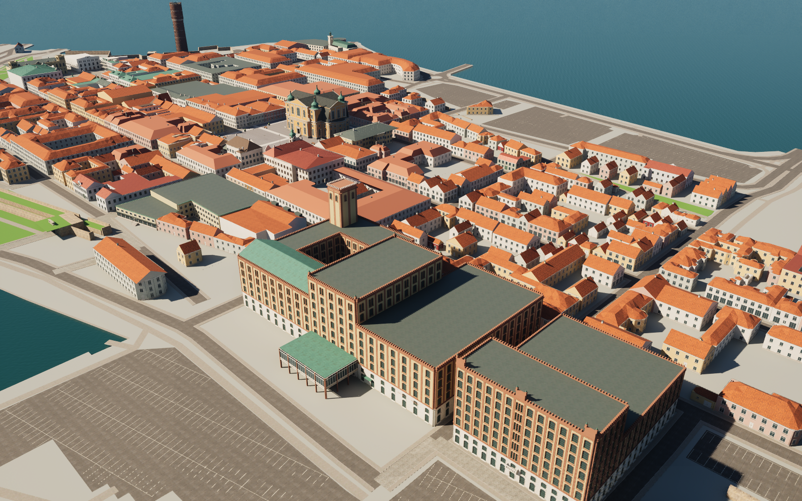
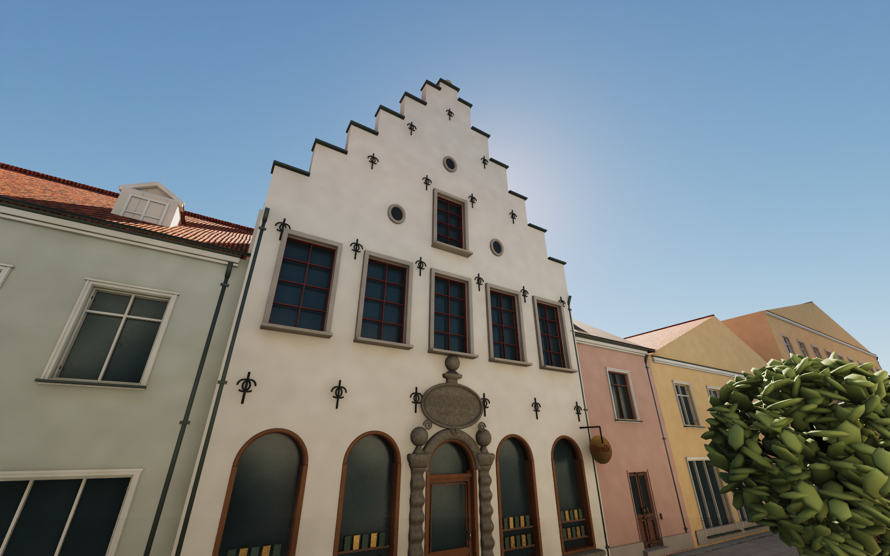

# Kalmar Kvarnholmen — an open 3D city project

An editable reconstruction of Kvarnholmen in Kalmar, Sweden, built in **Blender** and **Unreal Engine**. Explore the streets, improve a building you know, or reuse the original architecture in your own project.

**Work in progress:** this is a photo-informed interpretation, not a surveyed digital twin or finished AAA environment. The street network and building footprints use OpenStreetMap. Many background facades and building heights remain estimated.





## Get the project

The code, map data and build scripts are in Git. Large editable assets are versioned [release downloads](https://github.com/fltman/kalmar-kvarnholmen/releases), verified by SHA-256. **Git LFS is not required.**

```sh
git clone https://github.com/fltman/kalmar-kvarnholmen.git
cd kalmar-kvarnholmen
python3 tools/fetch_assets.py
```

On Windows use `python` instead of `python3`. The setup script downloads the version pinned in `assets/manifest.json`, checks the archives and each extracted file, and refuses to overwrite modified local files. Expect several gigabytes of extracted assets plus temporary download space. For Blender only, fetch `--bundle blender-source` and `--bundle textures`; for Unreal only, fetch `--bundle unreal-assets`. The ZIPs can also be downloaded and extracted manually into this repository's root.

- **Blender:** open `source/Stortorget.blend`. Texture paths are relative to `exports/textures/`.
- **Unreal:** open `Unreal/KalmarStortorget.uproject`, then `/Game/Kalmar/Maps/Stortorget`. Allow shaders and derived data to build on first launch.
- **Other tools:** exported meshes are in `exports/meshes/`, with material metadata in `exports/manifest.json`.

The working environment used Blender **5.2.2 LTS** and Unreal Engine **5.8.2** on macOS. Other platforms have not yet been verified. On macOS Unreal needs a working Xcode/Metal toolchain. Unreal Engine must be installed separately and is governed by Epic's license.

In Unreal, press **Play**, then click the viewport. Use **WASD**, mouse look, and **Space**; **Esc** exits Play. Review cameras are grouped in the Outliner; right-click one and choose **Pilot**.

## What is here

- Stortorget, the cathedral exterior and modeled interior, town hall and surrounding buildings.
- Storgatan to Larmtorget, the wider Kvarnholmen street network and mapped building inventory.
- Individually developed landmarks including Gerdas / Castenska gården, the mill complex, old bathhouse, old fire station, city gates, and waterfront buildings.
- PBR surface textures with normal and roughness maps, plus Unreal materials, lighting and collision.
- Python generators, reference provenance, and geometry / import / traversal checks.

The earlier correction pass distinguishes Riskvarnen from Ångkvarnen, replaces Gerdas' generic frontage, separates the overlapping Stortorget frontages, restores Barometern's entrance, articulates Witt's rear, and adds mapped green and parking surfaces. The [portal detail pass](docs/REFINEMENT_19.md) improves Gerdas’ carved portal and timber door, and Varmbadhuset’s gables, copper caps and entrance. The [first street pass](docs/REFINEMENT_20.md) refines six houses, including Kullzénska and Areskogska at the Norra Långgatan corners, plus Storgatan shopfronts and glass oriels. The [northern street pass](docs/REFINEMENT_21.md) adds seven individually authored facades and wings, including the Köpmantorget passage and Gallerian’s north entrance. The latest [Kaggensgatan and Larmgatan pass](docs/REFINEMENT_22.md) refines four more buildings and wings toward Fiskaregatan, including brickwork, projecting windows and recessed shops. See [known limitations](docs/KNOWN_ISSUES.md).

## Render images and flythroughs

The [media export workflow](docs/MEDIA.md) prepares 343 building views and two flythroughs. It renders lossless stills at 1920 × 1080 and film frames at 1920 × 1080, using Cinematic settings and 64 spatial samples. The scripts build an offline searchable gallery and verified H.264 films. Generated media is kept outside Git.

## Contribute

Start with [CONTRIBUTING.md](CONTRIBUTING.md). Local knowledge is especially valuable: correct window counts, roof profiles, entrances, building heights and properly licensed close-up references. Small, documented improvements to one building are easier to review than an island-wide regeneration.

Code is **MIT**. Original models, texture work and documentation are **CC BY 4.0**. OpenStreetMap-derived databases retain **ODbL** terms. Poly Haven sources are **CC0**; bundled Epic template assets retain Epic's terms. Read [LICENSE](LICENSE) and [THIRD_PARTY.md](THIRD_PARTY.md) before reuse. The public edition omits the earlier CC BY-SA altar photograph.

**Attribution:** Kalmar Kvarnholmen by Anders Bjarby and contributors, CC BY 4.0; geographic data © OpenStreetMap contributors, ODbL 1.0.
