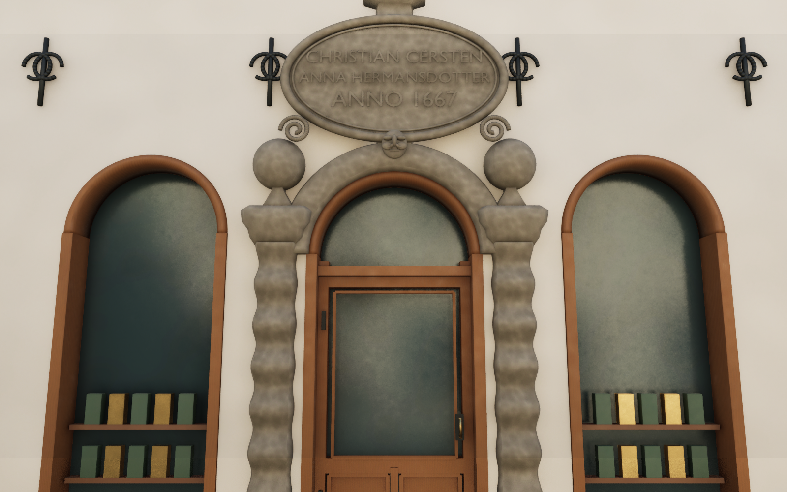
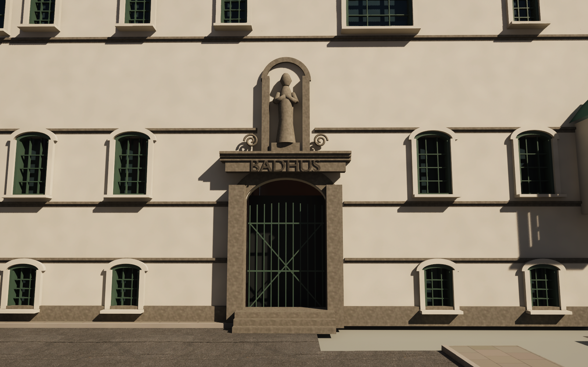
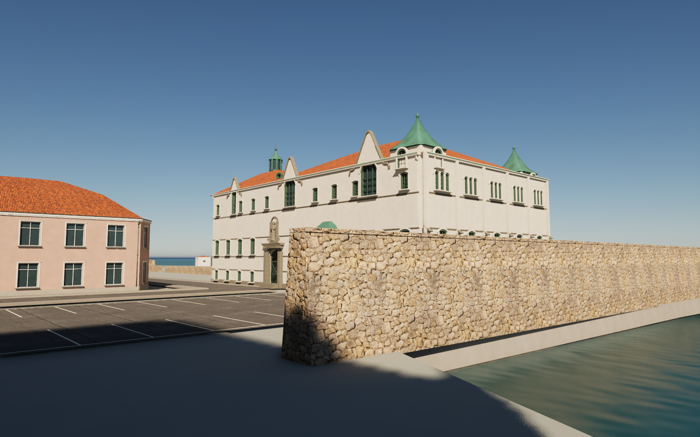

# Gerdas and Varmbadhuset — detail pass 19

## Gerdas / Castenska garden

The earlier portal had block-like stacked pilasters, an uninterrupted glass door, and an arch obscuring the year on its oval cartouche. It now has continuous wave-cut pilasters and mouldings, supported stone finials, a clear inscription, a stylised keystone mask, and recessed timber joinery with a fanlight, lower panels, hinges and handle. Arched shop-window linings close the visible gaps around the old frames. The first-floor sill level clears the upper finial.

## Varmbadhuset

Rounded gable peaks and continuous stone copings replace triangular tops with visibly segmented trim. Curved square copper caps replace the four-sided radial caps. Arched window linings now have continuous depth; duplicate gable joinery is removed. Facade bands stop at the entrance and sculpture niche. The entrance has a proper inscription frieze and the figure has a support plinth.

## Materials and validation

The original 0.5 m carved-stone texture uses base colour, roughness and OpenGL normal maps, generated by `scripts/make_portal19_texture.py`. Unreal flips the normal map's green channel. A darker stone variant makes the BADHUS inscription readable. Reference photos are not embedded or distributed; see [source notes](../references/portal19-notes.md).

Both Blender builds have no zero-area UV triangles. Final FBX normals/tangents/binormals and Unreal render buffers were checked, and the 269 m Storgatan character-clearance/ground check passed. The public map resolves all meshes and materials for its 694 actors. Seven saved Unreal assets were copied from the validated development editor; their checksums are recorded in `previews/refinement19-asset-copy.json`. The public Blender scene was rebuilt independently with relative texture paths and its neutral altar retained.

These are estimated architectural details, not scans. The bathhouse figure and portal mask remain schematic. This pass is not a performance optimisation or a claim of finished AAA quality.

## Regenerate this pass

With release assets already downloaded, run `python3 scripts/make_portal19_texture.py`, then Blender background scripts `scripts/rebuild_portal19.py` and `scripts/rebuild_bathhouse19.py`. Run `refresh_portal19.py` and `refresh_bathhouse19.py` in the Unreal **editor**, not a commandlet (they use editor-only mesh services). Remove their completed import checkpoint JSON files in `previews/` before intentionally importing a changed revision.
