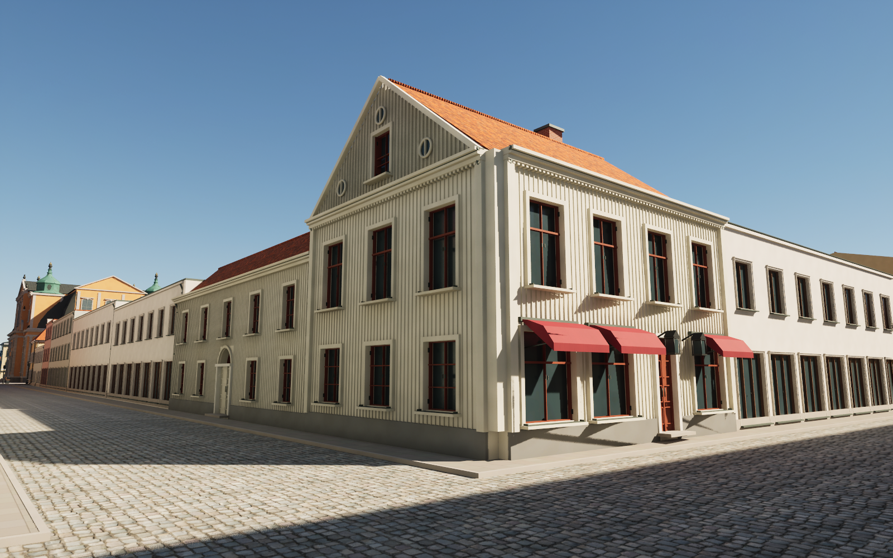
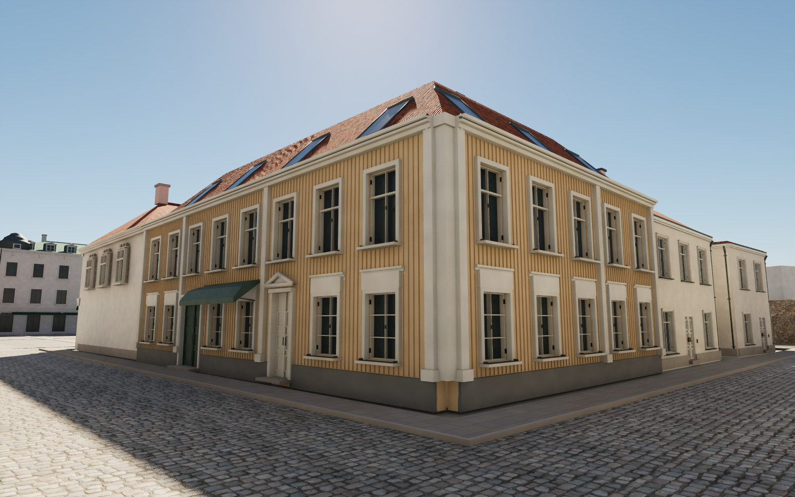
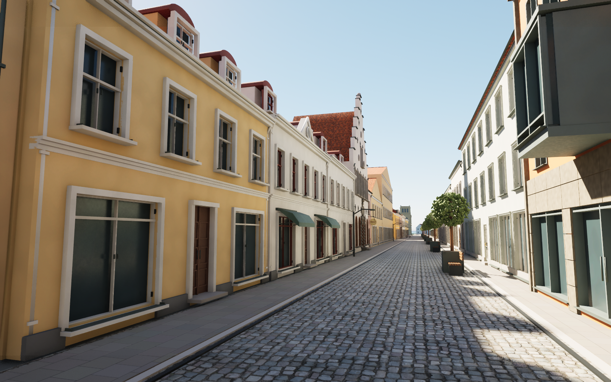
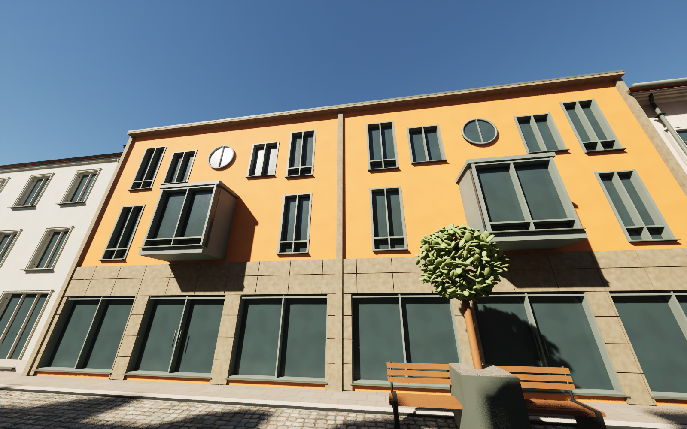

# Storgatan and the northern street corners — pass 20

Six existing houses now have individually authored street facades. This is a first reference-specific batch on Storgatan, Norra Långgatan, Kaggensgatan and Larmgatan; the remaining houses on these streets still need individual review.

## Kullzénska gården

The Kaggensgatan cafe elevation and Norra Långgatan gable now use cream timber boards, red cross casements, burgundy supported awnings, three circular attic vents, a recessed attic casement and a pitched tiled roof. The lower north wing has smaller divided windows and an arched gate. The mapped courtyard remains open.

## Areskogska gården

Both the Larmgatan and Norra Långgatan sides have warm timber panels, pale pilasters, smaller ground-floor windows and distinct coach and pedestrian entrances. A broken hipped tiled roof with flush skylights replaces the generic roof. The corner join is closed with continuous trim.

## Storgatan

Three south-side frontages beside Gerdas have separate plaster colours, window rhythms, shop entrances, green awnings, rounded red metal dormer hoods and a solid central pediment. The orange northern frontage has two projecting glazed oriels, circular upper windows, slim metal frames and jointed stone cladding at shop level. Existing Gerdas geometry is preserved.

## Reproducibility and checks

- Six FBX meshes: no zero-area UV triangles; exported normals, tangents and binormals checked.
- Unreal's imported render buffers: no zero, nonfinite or nonunit normal/tangent vectors.
- Dedicated materials retain original/CC0 normal and roughness maps, with appropriate linear normal sampling and Unreal green-channel conversion.
- Four-street traversal check: 239 ground samples and 216 character-width capsule segments, no unresolved obstruction. The existing Kaggensgatan route goes through the clear part of Jordbroporten.
- Repeating the scoped Blender build preserves identical mesh positions, topology, UVs and material assignments; `previews/street20-repeatability.json` records the hashes.
- `source/street20-base.json` is a stable snapshot of the six pre-pass meshes. The builder uses it only to retain unaffected rear geometry, preventing accumulated clipping fragments after repeated edits.
- The public Blender scene was rebuilt separately. Seventeen saved Unreal assets were copied from the validated development editor; the public map was then checked for missing models/materials and retains the neutral altar canvas.

References, dates and the less certain Storgatan #22 frontage are documented in [source notes](../references/street20-notes.md). Reference photographs are not embedded or redistributed. Building heights and hidden details remain estimates. Shop interiors and many surrounding houses are still schematic; this is not a claim of finished AAA quality or performance optimisation.

## Rebuild

Download the pinned release assets, then run Blender with `--background --python scripts/rebuild_street20.py`. Use `scripts/audit_street20_fbx.py` and `scripts/audit_street20_geometry.py` for mesh checks. Run `scripts/sanitize_public_blend.py` after rebuilding the public scene to keep its texture paths relative.

In the full Unreal editor, run `Unreal/Content/Python/finalize_street20.py`. Before intentionally importing a changed revision, remove the completed `previews/street20-import.json` checkpoint. The importer needs editor-only mesh services and cannot run as a commandlet. Review cameras 91–97 show the refined frontages and their street approaches.
