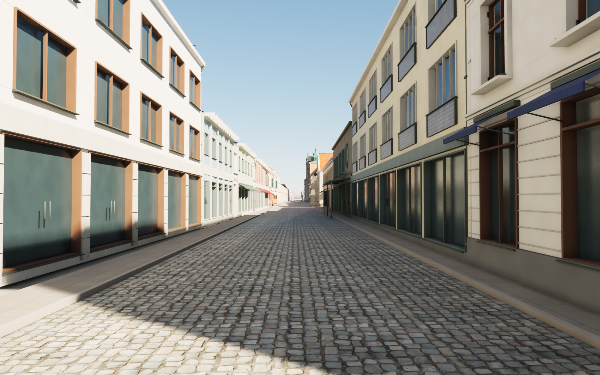
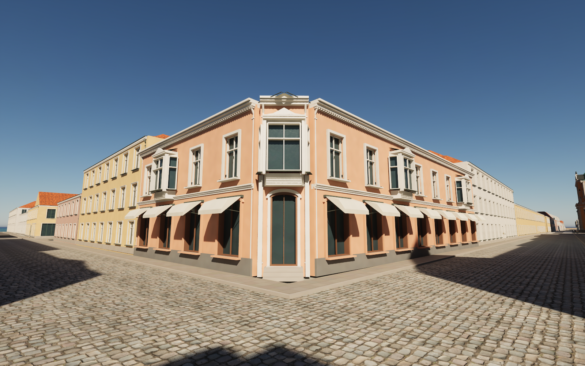
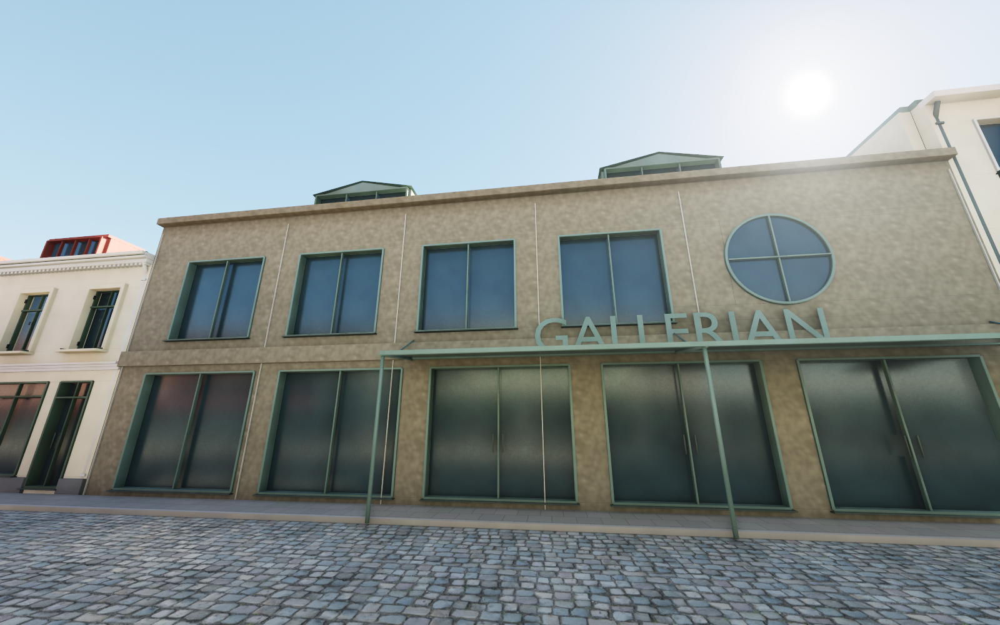

# Norra Långgatan and its street corners — pass 21

Seven buildings or street wings now have individually authored facades along Norra Långgatan, with returns onto Kaggensgatan and Larmgatan. The models follow exterior panorama references rather than reusing one generic house elevation.

The cream corner has two storeys, green cross casements and a coach gate, red box dormers and a dentilled cornice. Across Kaggensgatan, the rose corner has white projecting bays, panelled aprons, shaped crests, a chamfered entrance and cream awnings. The long northern shopping wing uses separate blue, green and red infill blocks, concrete piers, grey connectors and an open Köpmantorget passage.

At Larmgatan, the modern white corner has broad brown-framed windows, shop glazing, projecting bays and a roof railing. The classical white corner opposite it has three storeys, brown cross casements, a rusticated shop base and navy awnings. The adjoining cream strip has four-part window groups and grey ceramic aprons with newly authored procedural colour, roughness and normal maps. Gallerian's north entrance has a circular upper light, large windows, a supported canopy and green roof lanterns; its existing Storgatan frontage is preserved.

## Scope and rebuilding

Heights, hidden rear elevations and some window counts remain estimates. Retail interiors are not reconstructed. This batch does not cover every house on all three streets and is not a claim of finished AAA quality. Panorama dates and per-building uncertainty are listed in the [reference notes](../references/street21-notes.md). No reference-photo pixels are distributed.

Download the pinned release assets, then run Blender with `--background --python scripts/rebuild_street21.py`. Run `scripts/audit_street21_geometry.py` twice around an unchanged rebuild to check deterministic positions, topology, UVs and material assignments; `scripts/audit_street21_fbx.py` checks the exported vectors. The fixed `source/street21-base.json` preserves untouched parts without accumulating old clipping fragments. `scripts/sanitize_public_blend.py` restores portable relative texture paths after a public rebuild.

In the full Unreal editor, run `Unreal/Content/Python/finalize_street21.py`. Before deliberately reimporting a changed revision, remove the completed `previews/street21-import.json` checkpoint. Review cameras 98–105 cover the facades and street approaches. The importer requires full-editor mesh services, not a commandlet.

## Validation of this snapshot

- Seven exported meshes: no zero-area UV triangles and no zero or nonfinite exported normal, tangent or binormal vectors.
- Unreal render buffers: no zero, nonfinite or nonunit normals/tangents. Twelve dedicated materials retain normal and roughness inputs, linear normal sampling and Unreal green-channel conversion.
- Four-street traversal: 239 ground samples and 216 character-width capsule segments pass. The Köpmantorget passage also passes a full-width capsule sweep and 17 ground samples after removal of an old rear sockel fragment.
- Repeated development builds produce identical geometry, topology, UVs and material assignments. The separately rebuilt public scene matches all seven geometry hashes. UVs are projected deterministically after bevel application.
- Twenty-three saved Unreal assets were copied into the public scene, whose neutral altar and asset references are checked separately.
