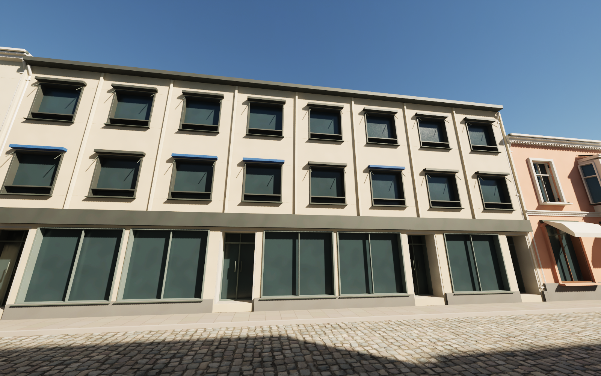
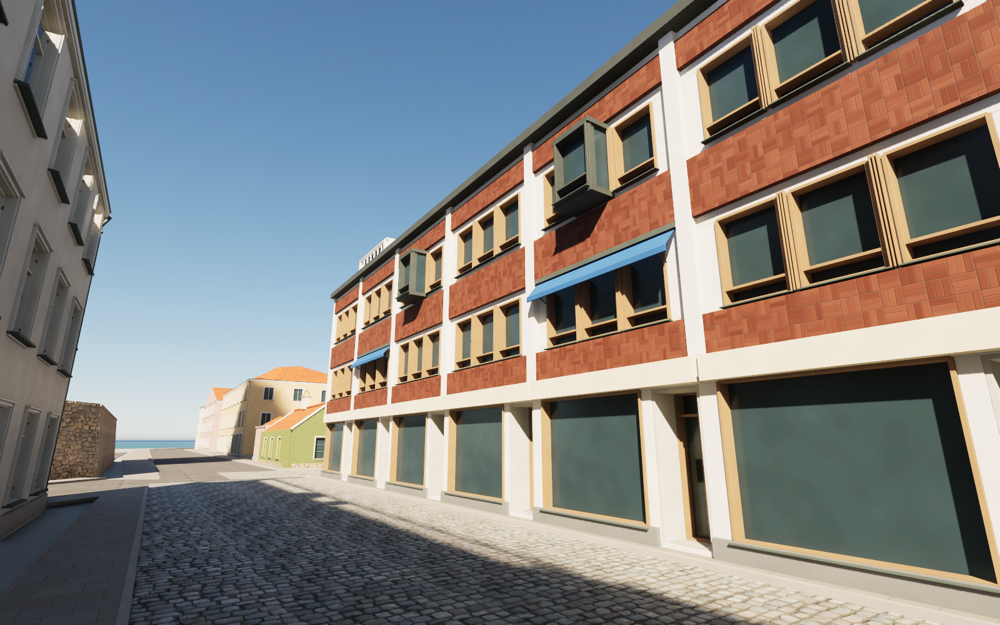
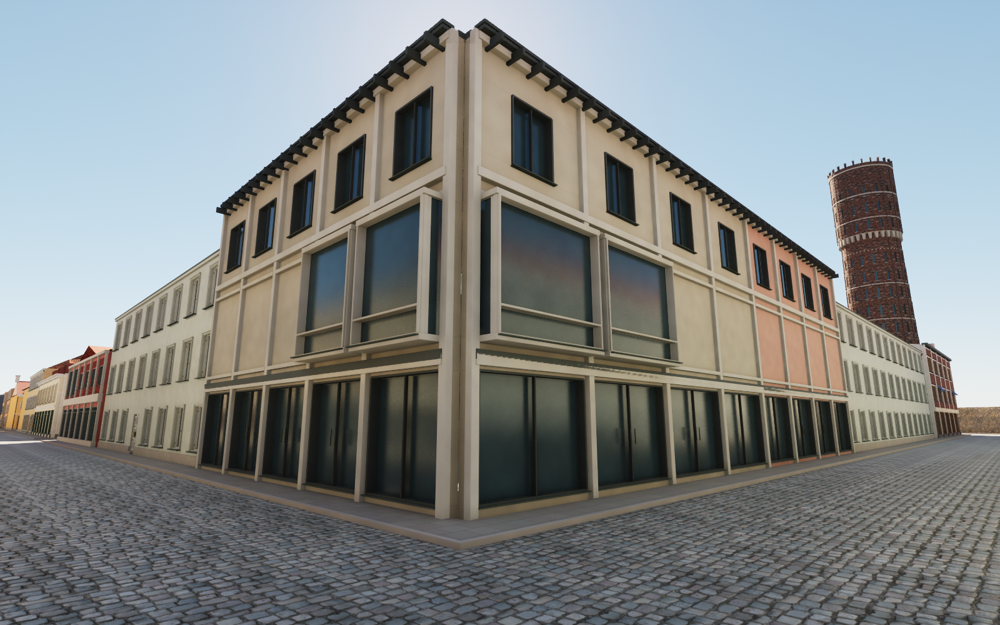
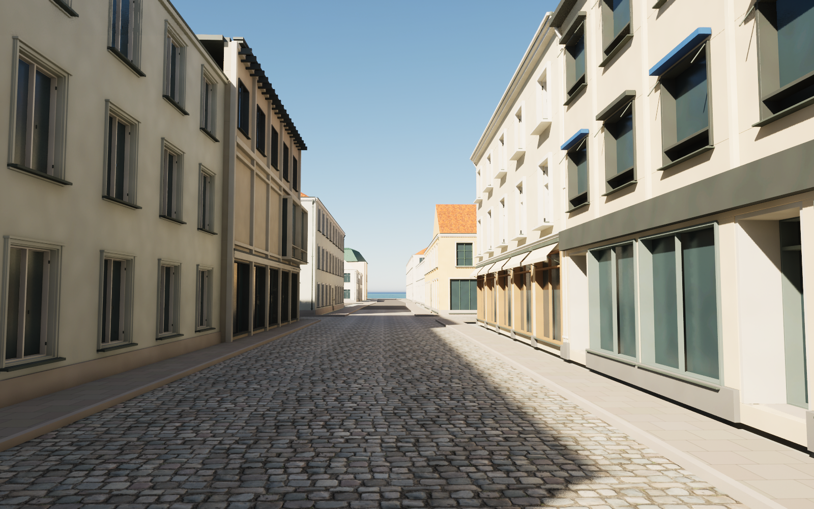
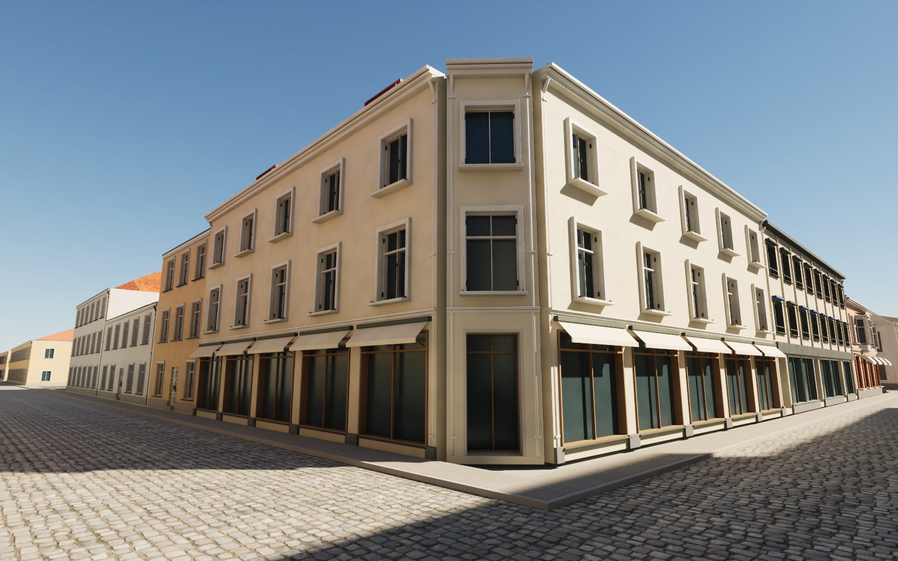
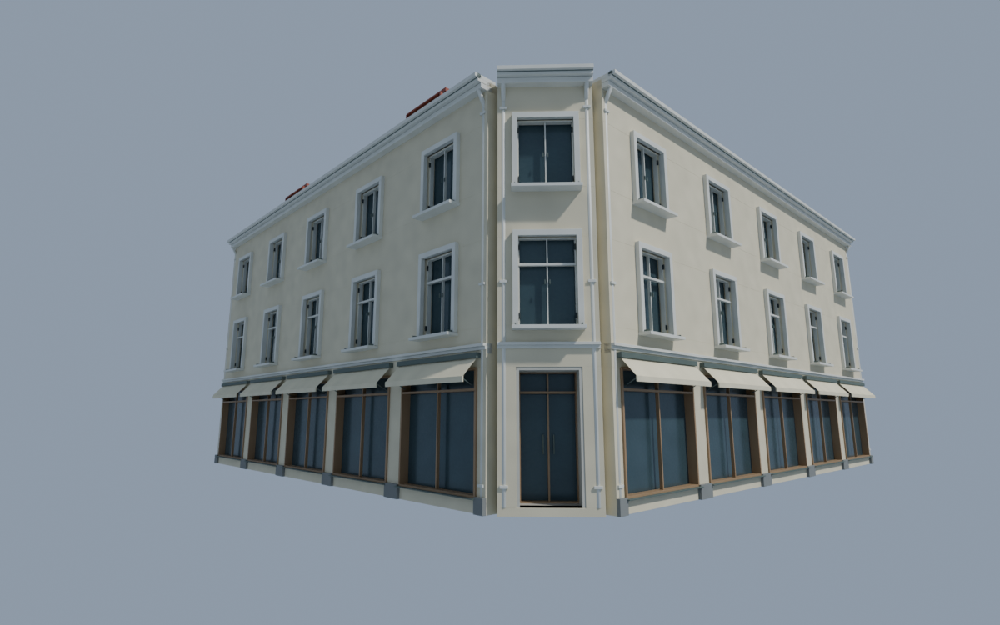

# Kaggensgatan and Larmgatan toward Fiskaregatan — pass 22

Four buildings or selected street wings now have reference-informed elevations. This continues northward from the previous Norra Långgatan corner work.

The pale Kaggensgatan/Fiskaregatan corner has three storeys, a chamfered and recessed entrance, white casements with different divisions on the two upper floors, red metal dormers and individual awnings. Kaggensgatan 30 has eight modern office bays, narrow pale pilasters, dark shop fascia, recessed doors and occasional blue awning cassettes; its unstudied rear wings remain unchanged in form.

Larmgatan's brick facade has a white structural frame, timber window groups, narrow timber strips, projecting metal box windows, recessed shop entrances and dark roof dormers. Its clinker maps are original procedural colour, roughness and normal textures with mortar relief. The shopping block's north-east corner has framed aggregate panels, blind middle fields, tall projecting glazed bays and paired top-floor windows. Its lower coloured Norra Långgatan wing and the open Köpmantorget passage are retained.

## References and limitations

The [source notes](../references/street22-notes.md) identify the April 2025 Google panoramas and the Corem exterior photograph actually viewed. No photograph pixels are embedded or redistributed. Heights, some bay spacing, hidden returns and upper roof profiles remain estimates. The north return of the Larmgatan building is an interpretation from the visible facade rhythm. Retail interiors and all remaining street facades are not completed; this is not a claim of finished AAA quality or performance optimisation.

## Rebuild

Download the pinned release assets. Run Blender with `--background --python scripts/rebuild_street22.py`, and run `scripts/sanitize_public_blend.py` on the public scene to restore relative texture paths. The stable `source/street22-base.json` retains unaffected facade work between rebuilds. `scripts/make_street22_textures.py` regenerates the original clinker maps.

`scripts/audit_street22_geometry.py` checks repeated builds; `scripts/audit_street22_fbx.py` checks exported normal/tangent vectors. In a full Unreal editor, run `Unreal/Content/Python/finalize_street22.py`. Remove or reset the completed `previews/street22-import.json` checkpoint only when deliberately importing a revised mesh. Cameras 106–111 show the elevations and street approaches.

## Validation of this snapshot

- Four FBX meshes: no zero-area UV triangles and no zero or nonfinite exported normal, tangent or binormal vectors.
- Actual Unreal render buffers pass normal/tangent checks; all eight dedicated materials have normal and roughness inputs.
- Four-street traversal passes 239 ground samples and 216 character-width capsule segments without obstructions; the Köpmantorget passage also passes its capsule sweep and 17 ground samples.
- Repeated working builds are identical, and the separately rebuilt public Blender scene matches all four geometry hashes.
- The public Unreal world contains 715 actors with no missing mesh or material references. Its neutral altar remains independent of the research photograph.
- Six Unreal street-level views were inspected. The final pale-corner roof correction was also checked in Blender, reimported and buffer-validated in Unreal, then visually verified in Unreal after restarting the computer. The saved Blender scene and all sixteen changed Unreal files matched the published v0.1.4 checksums before reopening. The review callback refreshes its world reference after scripted map changes.
- The office roof follows the neighbour's notch, and the pale corner roof is clipped to the chamfer without the former projecting gutter fragments.

High-triangle collision warnings remain in the wider city; this pass validates traversability and surfaces, not packaged-game performance.

