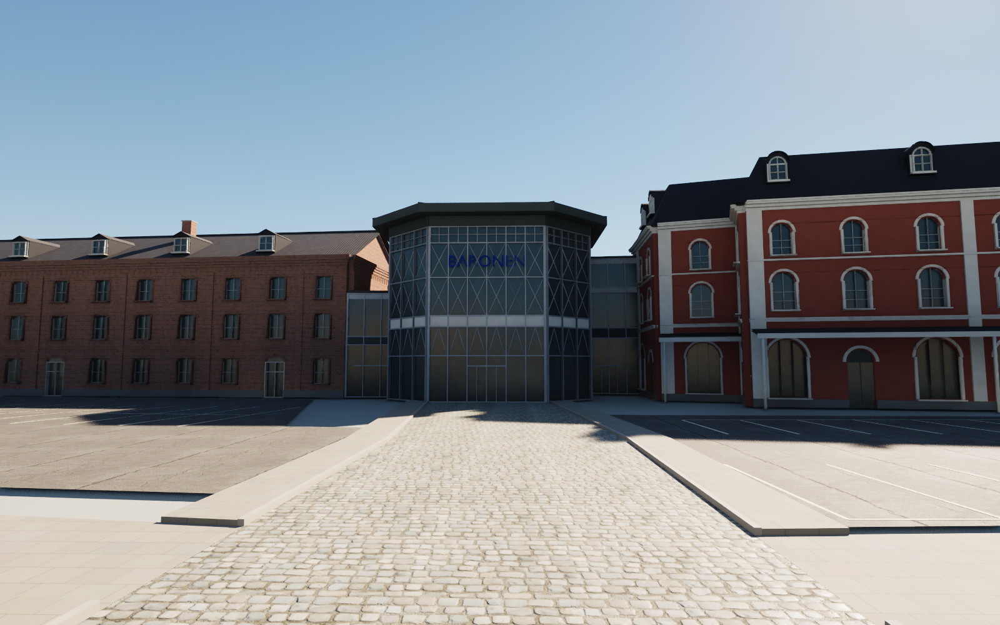
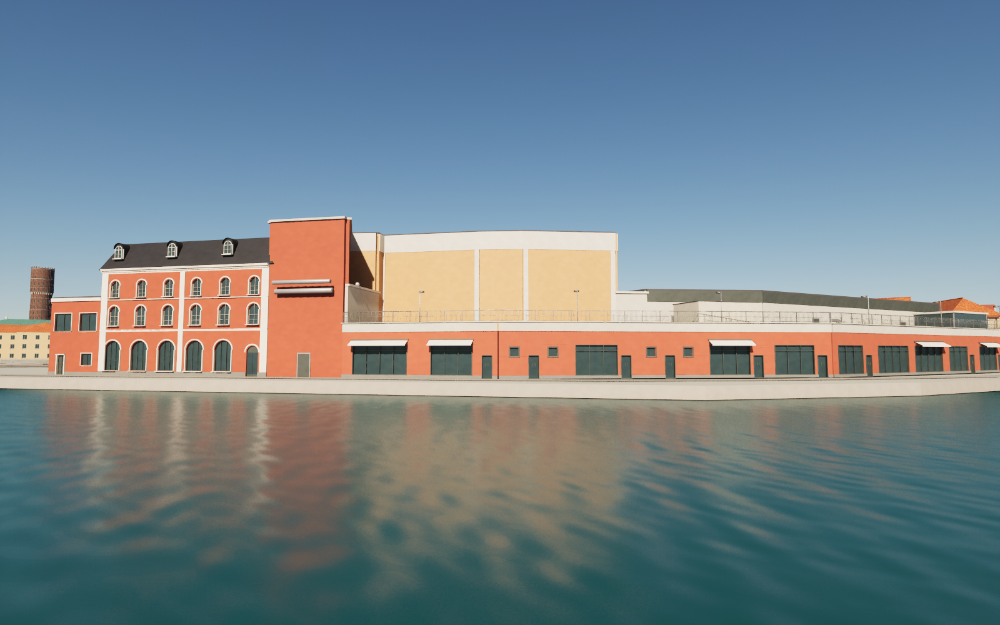

# Baronen shopping centre at Ölandshamnen — pass 23

Baronen (OSM way 38033725), between Skeppsbron and Ölandshamnen, replaces a generic district block. The complex opened in 1964 as Kalmar Stormarknad in the former Svea margarine factory and took its present name in 1977.

The model has the rendered mansard house: its north wing on Skeppsbrogatan, the west wing and a south wing reaching the quay. It also has the octagonal glazed entrance, lettered BARONEN, and the narrow glass link. The brick factory has pilasters, an arched corbel frieze and a dog-tooth course. Home Hotel Packhuset has three storeys of cream render, red dormers and a white entrance box. Also modelled are the inner courtyard wing, the annex and the mall's flat halls with the glazed dome. The harbour side has the pale box with framed panels, the cinema's red wall with its ducts, and the low quay shops under the parking deck with bays, lamp posts and railing. It also has the gym in profiled cladding with red mesh screens and the garage portal, and the glass pavilion in front of the west wing.

## Calibration

`scripts/prepare_baronen23.py` splits the OSM outline into zones with Shapely (`source/baronen23.json`). A wall is built only where it shows above its neighbour's roof. Three documented additions lie outside the mapped outline: the glazed slot between the entrance and the brick gable (56 m²), the regular octagon (15.9 m²) and the pavilion (96 m²).

The model was rendered from the positions, headings, pitches and vertical fields of view of four Street View panoramas (three from April 2025, one from September 2021) and compared with them in the browser. This comparison led to several changes:
- The mansard house was extended over the mapped step.
- Packhuset was raised to three storeys.
- The pale box was narrowed to 32.4 m and raised to 16.5 m.
- The cinema wall and the south mansard wing were added.

In the final state, the factory's window rows, eaves and dog-tooth course, the glass tower and the mansard windows lie within a few pixels of the panoramas. Pass 24 found that these comparisons had stretched the screenshots 7.4 % horizontally. Heights are unaffected, but widths read from the images can be off by up to about 1 m at the frame edges; see the [source notes](../references/baronen23-notes.md).

## References and limitations

The source notes list the museum page, the hotel photograph and the panoramas actually viewed. No photograph or panorama pixels are embedded or redistributed. Seventeen new materials tint existing texture sets towards colours read from the photographs. Two original texture sets are included: white trapezoidal cladding and orange-red machine brick in cross bond.

Heights and hidden fronts are estimates, even where calibrated. Several parts are interpretations:
- the marina front of Packhuset
- the courtyard fronts
- the annex
- the hall roofs.

The descending garage ramp is a dark portal, because the terrain is flat. The deck's vehicle ramp and the external stair are missing. Shop signs and logos are omitted, and no interiors are built.

## Rebuild

Download the pinned release assets. Run Blender with `--background --python scripts/rebuild_baronen23.py`, then `scripts/sanitize_public_blend.py` on the public scene. `scripts/make_baronen23_textures.py` regenerates the two texture sets. `scripts/prepare_baronen23.py` needs Shapely (`requirements.txt`). In Unreal, `Unreal/Content/Python/finalize_baronen23.py` imports the pass and validates it. Remove `previews/baronen23-import.json` only when deliberately importing a revised mesh. Cameras 112–122 show the pass; 120–122 are the calibration views.

## Validation of this snapshot

- Six meshes (about 1.11 million triangles) have no zero-area UV triangles and no zero or nonfinite exported normal, tangent or binormal vectors.
- Unreal render buffers pass the normal and tangent checks, and all 17 materials have normal and roughness inputs.
- Repeated builds are identical. The separately rebuilt public Blender scene matches all six geometry hashes.
- 415 ground samples and 391 character-width capsule segments pass without obstruction. They cover Skeppsbrogatan, Skeppsbron, Kaggensgatan, Ölandskajen, the quay promenade and the entrance approach, and the parking deck carries.
