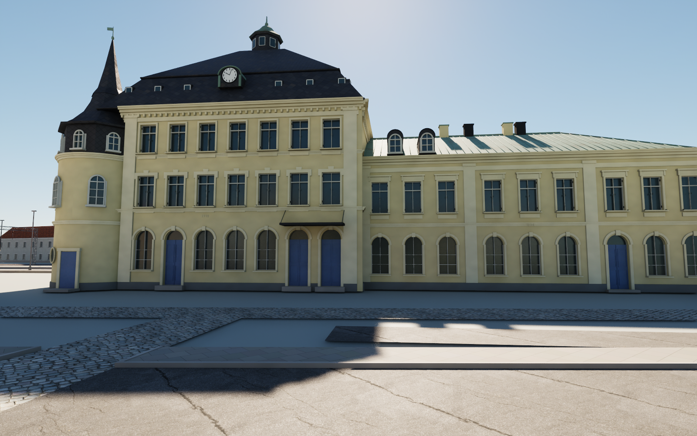
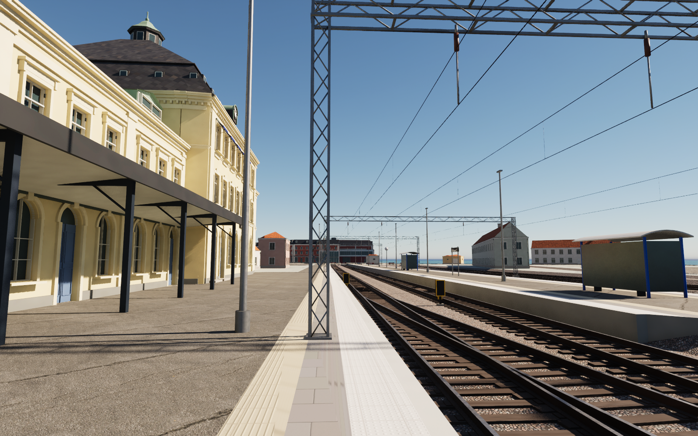

# Kalmar C station house — pass 24

The station house (OSM ways 90965009 and 90965025) replaces two generic volumes.

The two-storey range of 1874, designed by Hjalmar Kumlien, has nine axes on each long front in three pilaster groups. Its ground floor is round-arched, and its upper windows have cornices. It carries the inscription 1874 and a hipped copper roof with modelled standing seams, two rounded dormers to the street and a wide dormer to the platform. The three-storey block of 1910 has a round corner tower with a slate-hung drum, bell roof and spire. Its roof has a steep lower band with attic lights, clock gables to street and platform, an upper pyramid of rhombic slates and an octagonal lantern. A lower south wing completes it. A platform canopy on steel columns runs along the 1874 range. The track side has the name board Kalmar C and the blue awnings seen in the photographs.

## Measurement

Heights were measured by inverting the Street View camera. For a pixel, the viewing ray from the panorama position is intersected with a vertical plane at the feature's depth; the base of the 1910 front comes out at 0.07 m, which checks the method. Measured heights:

| Feature | Height (m) |
|---|---|
| 1910 cornice | 13.0 |
| Clock | 15.3 |
| Roof break | 16.1 |
| Lantern base | 20.9 |
| Tower body | 9.4 |
| Tower drum | 11.5 |

The model was then rendered with the same camera and resolution and compared pixel for pixel. Two independent panoramas place the 1874 range's north-west gable 1.4–1.7 m beyond the OSM outline, so it is moved out 1.6 m (21.6 m² outside OSM). From this pass on, comparisons are rendered at the screenshot's own resolution; the earlier pass-23 comparisons had resampled the screenshots.

## References and limitations

The [source notes](../references/station24-notes.md) list the Commons photographs and panoramas actually viewed; `references/station24/sources.json` records their authors and licences. No photographs are redistributed, and no pixels are embedded. Eleven new materials tint existing texture sets, plus one original texture set of rhombic slates. Only the building's own inscriptions (1874, 1910) and the station name are lettered.

Several features are estimated:
- the south wing's heights
- the platform-side door layout
- the roof sides facing north-west and south-east.

The spire height follows a 2022 photograph. The restaurant's signs and awnings and the kiosk porch are omitted, and no interiors are built.

## Rebuild

Download the pinned release assets. Run Blender with `--background --python scripts/rebuild_station24.py`, then `scripts/sanitize_public_blend.py` on the public scene. `scripts/make_station24_textures.py` regenerates the slate maps. In Unreal, run `Unreal/Content/Python/resume_station24.py` with `-HeroIdle`, then `validate_station24.py`. Remove `previews/station24-import.json` only when deliberately importing a revised mesh. Cameras 123–129 show the pass; 128–129 are the calibration views.

## Validation of this snapshot

- Three meshes (about 273,000 triangles) have no zero-area UV triangles and no zero or nonfinite exported normal, tangent or binormal vectors.
- Unreal render buffers and all eleven materials pass.
- Repeated builds are identical. The separately rebuilt public Blender scene matches all three geometry hashes.
- 128 ground samples and 119 capsule segments pass without obstruction. They run along Stationsgatan, in front of both buildings, and on the platform 1.3 and 2.0 m from the walls, between the walls and the canopy columns. The test was re-run after pass 25 added the tracks and platform furniture.

Two faults were found and fixed during the work. Blender's font mesh contained coincident points that collapsed every bevel in the 1874 range, so the lettering is now merged and triangulated before placement. The first platform test also ran into the 1910 block's corner, which projects 1.5 m towards the track.
