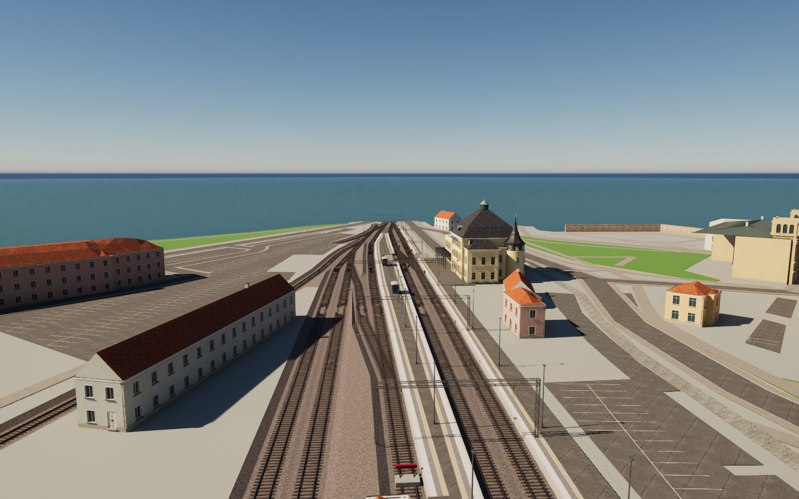
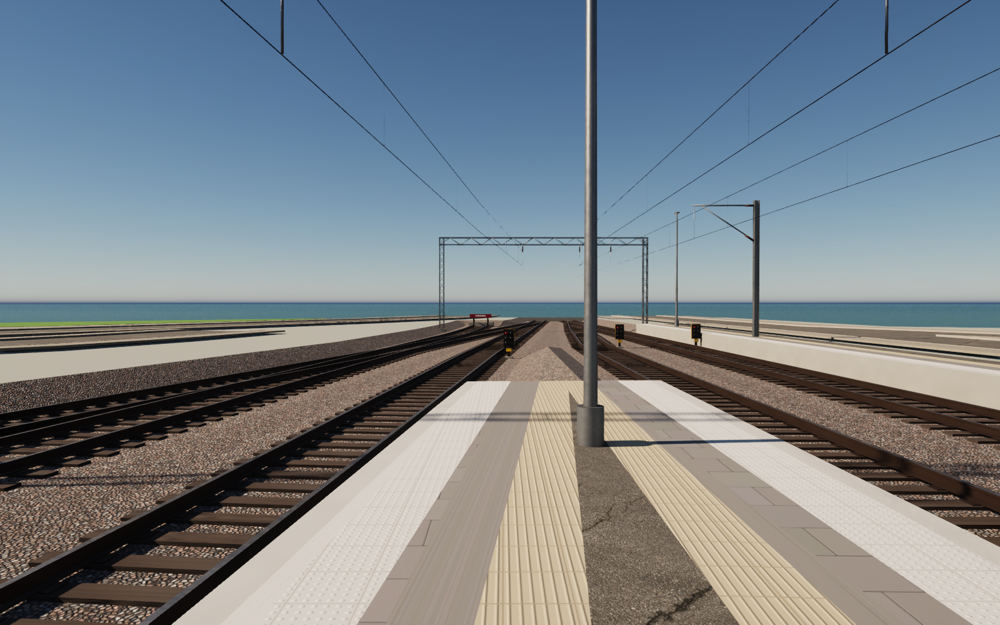
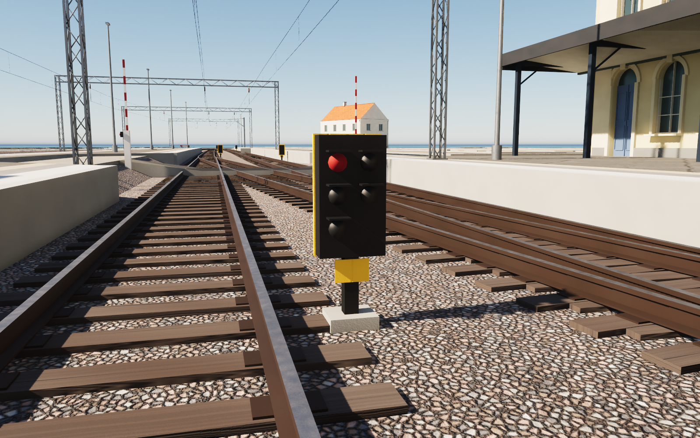
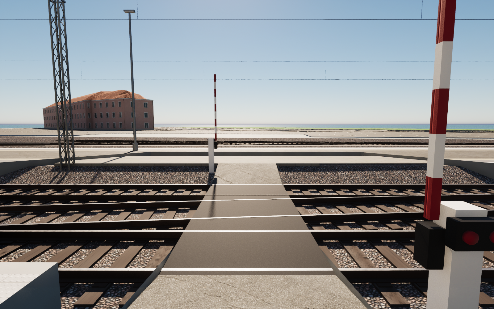

# Tracks and platforms at Kalmar C — pass 25

The railway area now runs from the bridge at the north-west edge of the model to the buffer stops south-east of the station house, all positioned from OpenStreetMap. It comprises:
- 15 track pieces (1,986 m)
- platforms 1a, 1b, 2a, 2b and 3, plus the house platform along the station (3,341 m²)
- seven buffer stops and seven dwarf signals
- a pedestrian level crossing with full barriers
- the overhead line over tracks 1–3.

Rails with a 172 mm flat-bottom profile and polished heads sit on timber sleepers with tie plates every 0.6 m. The ballast bed is cut into the island surface with a 1.2 m slope band, and narrow slivers between track groups become yard gravel.

Platforms stand 0.58 m above rail top. Their edges follow the zoning photographed on platforms 2b and 3: edge stone, light warning tiles with studs, grey slabs and a ribbed guidance strip, with asphalt beyond. Tile courses follow each platform's axis. A single row of lighting columns runs down the middle of each group of touching platforms. The island also has two glass shelters on blue columns, a Kalmar C name board and a two-faced clock on its own column.

Portals are lattice box girders on lattice masts, with drop tubes and brown insulators over each track. Cantilever masts carry track 1 elsewhere. The dwarf signals stand on the side given by `railway:signal:position`, face the direction in `railway:signal:direction`, and follow a photograph of signal Kac 14.

## Interpretation

- OSM traces platforms 2a, 2b and 1a 0.15–0.25 m further from the track than the rest. They are brought to a uniform edge 1.65 m from the track centre.
- OSM splits the island into three areas, but lamps, shelters, name board and clock follow the island's own centre line, as photographed. Columns keep 5 m from the station house.
- OSM tags only track 1 as electrified. The photographs show wires over the island tracks, so tracks 2 and 3 are wired between the first and last portal.
- The crossing's rubber panels lie 5 mm below rail top between the outer rails. Asphalt ramps beyond them are about 20 % steep, because they fit only within the ballast shoulder and slope band.

## References and limitations

The [source notes](../references/rail25-notes.md) list the OSM tags and the Commons photographs used (see `references/station24/sources.json`). No photograph pixels are embedded or redistributed. Four original texture sets come from `scripts/make_rail25_textures.py`: crushed granite ballast, ribbed guidance tiles, studded warning tiles and weathered sleeper timber.

Turnouts are the crossing rails of the mapped centrelines, without switch blades, frogs, check rails or point machines. The messenger wire is straight between supports. The buffer stop design is generic and furniture positions are interpreted. Cable troughs, balises, signs, railings, departure boards and trains are omitted. The full district build (`scripts/build_kvarnholmen.py`) does not yet include passes 23–25: apply the scoped rebuilds on top of the released scene.

## Rebuild

Download the pinned release assets. Run Blender with `--background --python scripts/rebuild_rail25.py`, then `scripts/sanitize_public_blend.py` on the public scene. The rebuild also replaces the island surface (`SM_Kvarnholmen_Land`) and street chunk 07_09 around the cut. `scripts/prepare_rail25.py` (Shapely) regenerates `source/rail25.json` from OSM. In Unreal, run `Unreal/Content/Python/resume_rail25.py` with `-HeroIdle`, then `validate_rail25.py`. Remove `previews/rail25-import.json` only when deliberately importing a revised mesh. Cameras 130–136 show the pass.

## Validation of this snapshot

- Seven meshes (about 161,000 triangles) have no zero-area UV triangles and no zero or nonfinite exported normal, tangent or binormal vectors.
- Unreal render buffers and all 23 materials pass.
- Repeated builds are identical. The separately rebuilt public Blender scene matches all seven geometry hashes.
- The collision test takes 1,128 ground samples and 1,108 capsule segments. It covers the walking line 1.2 m in from every track-facing platform edge (checked at platform height), the crossing (checked against its ramp profile) and the five named streets within 40 m of the tracks.
- All 20 obstructions have a verified detour of at most 2 m. Seventeen are masts standing in the walkway; three are lamp columns at the narrow ends of platforms 1a and 1b.
- The pass-24 platform test also passes again. Its first run found a platform lamp in the path along the 1910 block, which led to the 5 m clearance.

The railway meshes are built without the project's crafted 3 mm bevel: thin wires and rods collapse its overlap clamp, and the tile courses keep their authored UVs.
