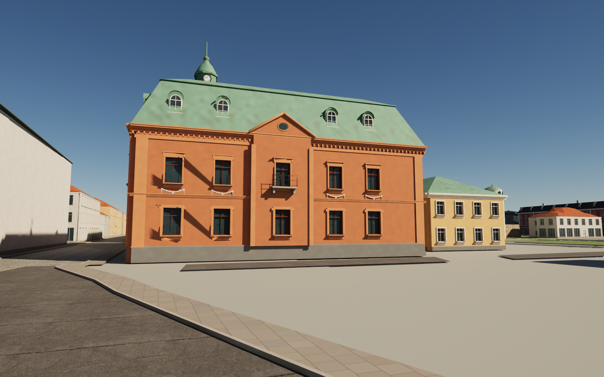
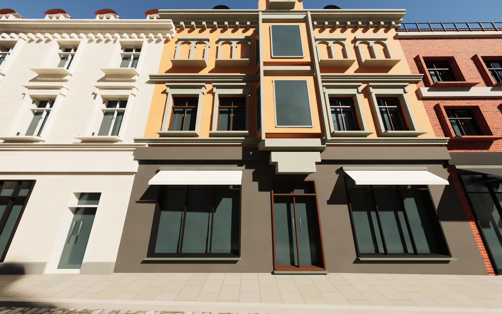
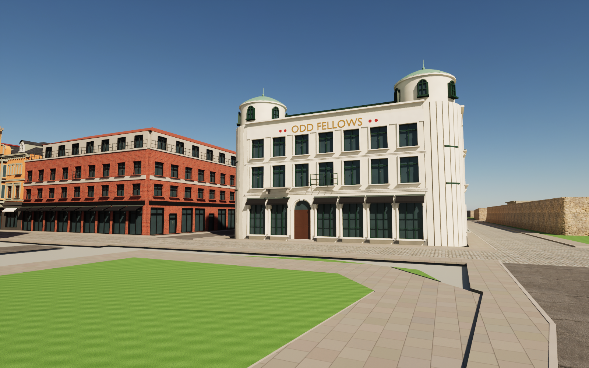

# Larmgatan by the station — pass 26

Five generic district volumes on Larmgatan, between Södra Långgatan and the station square, are replaced by individually modelled buildings:
- **The Larmgatan 1 bank** (OSM 91222222), in terracotta render over a granite plinth, with:
  - stucco festoons
  - a pedimented centre risalit with a balcony towards the station square
  - a round-arched ground floor and an entrance under a curved gable on Södra Långgatan
  - a chamfered corner with a balcony
  - a two-stage copper mansard with round-headed dormers
  - an octagonal clock lantern with four dials, an onion dome and a spire.
- **The same block's office and south wing:** the later office on Larmgatan and the lower south wing under a copper hip roof.
- **Larmgatan 10:** cream render, a shop floor, a round corner oriel and a red metal mansard.
- **Larmgatan 8:** orange render with grey-green trim over a dark stone shop floor, a corbelled oriel through two floors, twin round-headed windows and an arched attic gable.
- **Larmgatan 6:** red brick with large pub windows, iron railings and a set-back attic storey.
- **The Odd Fellows house at Larmgatan 2:** cream Jugendstil render, round corner turrets with copper caps, and a frieze lettered ODD FELLOWS between red roundels.

## Measurement and interpretation

Heights were measured by inverting the camera of Google Street View panoramas from April 2025, as in pass 24:

| Feature | Height (m) |
|---|---|
| Bank cornice | 10.8 |
| Bank mansard break | 15.4 |
| Bank upper roof and lantern base | 16.6 |
| Lantern dome | 18.8 |
| Lantern spire | 21.4 |
| Larmgatan 8 cornice | 11.3 |
| Larmgatan 8 attic gable | 13.0 |
| Larmgatan 6 street front | 10.0 |

The other heights are estimated from storey counts. The plaza panorama needed a −2.13° tilt correction, and Maps clamps the vertical field of view at 90°. The split of the Larmgatan 1 block into bank, office and south wing is read from the panoramas. The bank's corner is chamfered by 2.2 m and the Odd Fellows corners are rounded (radius 2.4 m), both within the OSM outlines. Courtyard fronts are interpretations. Tenant names, shop signs and logos are omitted; only the building's own name ODD FELLOWS is lettered.

## References and limitations

The [source notes](../references/larm26-notes.md) list the panoramas actually viewed. No panorama pixels are embedded or redistributed. The 26 new materials tint existing texture sets towards colours read from the panoramas; there are no new texture sets. No interiors are built.

## Rebuild

Download the pinned release assets. Run Blender with `--background --python scripts/rebuild_larm26.py`, then `scripts/sanitize_public_blend.py` on the public scene. `scripts/prepare_larm26.py` (Shapely) regenerates `source/larm26.json` from OSM. In Unreal, run `Unreal/Content/Python/resume_larm26.py` with `-HeroIdle`, then `validate_larm26.py`. Remove `previews/larm26-import.json` only when deliberately importing a revised mesh. Cameras 137–143 show the pass; 143 is the calibration view.

## Validation of this snapshot

- Five meshes (about 697,000 triangles) have no zero-area UV triangles and no zero or non-finite exported normal, tangent or binormal vectors.
- Unreal render buffers and all 26 materials pass.
- Repeated builds are identical, and the separately rebuilt public Blender scene matches all five geometry hashes.
- The collision test takes 868 ground samples and 847 character-width capsule sweeps. It covers walking lines 1.2 and 2.0 m outside every street front and Larmgatan, Södra Långgatan, Ölandsgatan and Stationsgatan within 40 m. The only obstruction is the bank's entrance steps, which have a verified detour 0.8 m further out.
