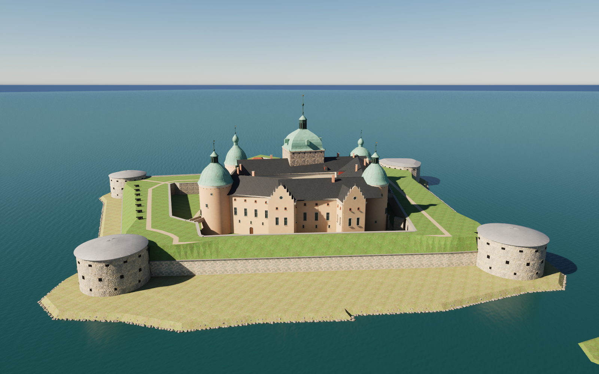
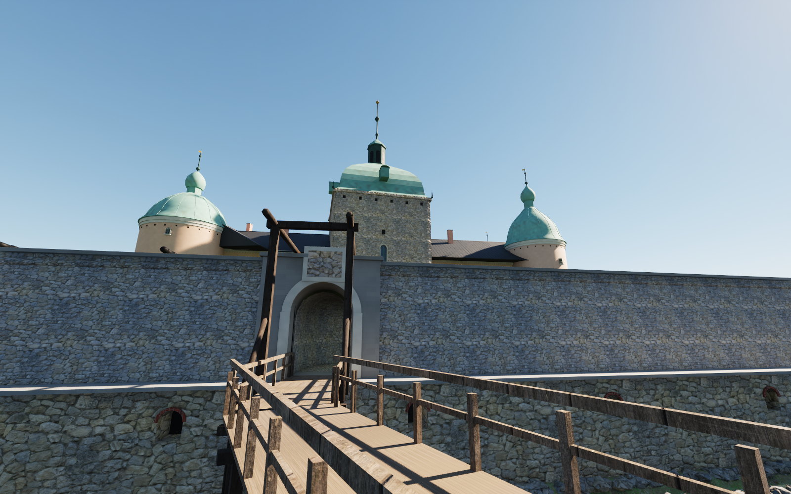
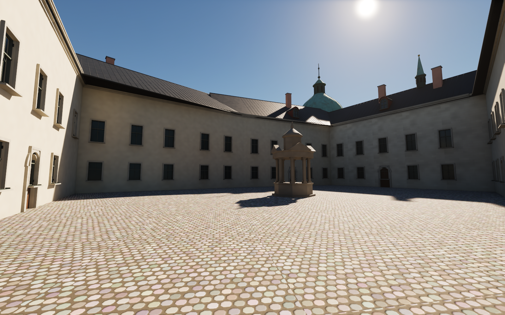
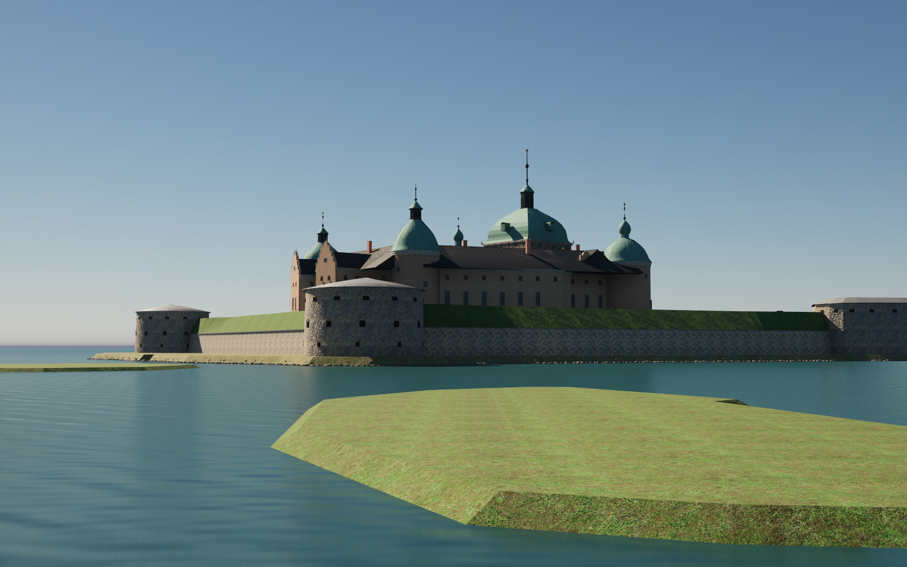

# Kalmar slott on Slottsholmen — pass 27

Kalmar slott and its whole island lie about 300 m west of the station, outside the earlier model boundary. They are modelled from OpenStreetMap:
- **The castle:** four ranges round the courtyard with the well house of 1578, and the square gate tower Kuretornet with its copper bell roof, open lantern and gilded crown. Four round corner towers carry copper caps, and there are the chapel's roof turret and stepped gables on the south-east and north-east fronts.
- **The fortifications:** the dry moat, the earth ramparts with guns, the curtain walls with grassed slopes, and the four low round postejer (gun towers).
- **The north-west side:** the lower wall with brick-arched casemate openings, the berm, the gate in an ashlar block, and the vaulted tunnel along its mapped line, with the walled gate building in the dry moat.
- **Beyond the island:** the timber bridge with its drawbridge frame, the ravelin with the castellan's house (Kastellanvillan), and three islets in Slottsfjärden.

The mainland (Stadsparken, Kalmarsundsparken) is not modelled, as everywhere else in the model. The bridge towards the park therefore ends at an abutment.

## Measurement

Heights were measured by inverting the camera of three official Street View panoramas from September 2014, taken on the south-west rampart, the bridge and in the courtyard. Each camera position was checked by resection against known points. The courtyard panorama's reported position proved 13.5 m off and was corrected. In metres above the water:

| Level | Height (m) |
|---|---|
| Dry-moat floor, gate threshold and bridge deck | 5.0 |
| Courtyard | 9.5 |
| Rampart top | 11.4 |
| Eaves | 21.6 |
| Corner tower walls | 24.6–25.6 |
| Corner tower finials | 40–44 |
| Kuretornet cornice | 32 |
| Kuretornet crown | 59 |

Helgo Zettervall's 1883 west elevation (Commons, public domain) agrees with the measurements within about 1 m and was used for the proportions of the caps. The review shots from the three calibration cameras (144–146) match the panoramas within a few pixels at the same vertical field of view.

## Interpretation

- The entrance follows OSM. The tunnel (`tunnel=yes`) runs from the gate to the counterscarp. The walk then passes the walled gate building, whose vaulted passage carries the dry-moat walk through it, and reaches the castle gate in the foot of Kuretornet.
- The ranges' roofs are gables over rectangles fitted to the outline, joined as their upper envelope. Deeper ranges have flatter roofs. The standing seams are modelled.
- The painted rustication is on the south-west courtyard front. The chapel's roof turret stands where Street View shows its spire.
- Estimated or interpreted: the north tower's height, the east tower's cap, the courtyard levels, the range roof depths and the gun positions.

## References and limitations

The [source notes](../references/castle27-notes.md) list the OSM data, the panoramas, and the Commons photographs with their authors and licences (`references/castle27/sources.json`). Photographs are not redistributed, and no pixels are embedded. The 36 new materials tint existing texture sets; there are no new texture sets.

The castle lies about 900 m from the model's origin, where 32-bit coordinates resolve only about 0.06 mm. Invisible slivers under 20 mm² and thinner than 1:100 are therefore removed at finishing, so that every exported vertex keeps a valid tangent frame.

Not modelled:
- the mainland and the moat's outer bank
- the steps and cobbled ramp from the tunnel mouth up to the rampart
- the gate passage through the castle
- sculpted portals and the coat of arms
- interiors, flags, signs and reeds.

## Rebuild

Download the pinned release assets. Run Blender with `--background --python scripts/rebuild_castle27.py`, then `scripts/sanitize_public_blend.py` on the public scene. `scripts/prepare_castle27.py` (Shapely) regenerates `source/castle27.json` from the OSM extract in `references/castle27/`. In Unreal, run `Unreal/Content/Python/resume_castle27.py` with `-HeroIdle`, then `validate_castle27.py`. Remove `previews/castle27-import.json` only when deliberately importing a revised mesh. Cameras 144–150 show the pass; 144–146 are the calibration views.

## Validation of this snapshot

- Ten meshes (about 627,000 triangles) have no zero-area UV triangles and no zero or non-finite exported normal, tangent or binormal vectors.
- Unreal render buffers and all 36 materials pass.
- Repeated builds are identical, and the separately rebuilt public Blender scene matches all ten geometry hashes.
- The collision test takes 843 ground samples and 834 character-width capsule sweeps. Each capsule rides the surface of its route:
  - the bridge
  - the tunnel and the walk to Kuretornet
  - the rampart walk
  - two dry-moat walks
  - the courtyard
  - the ravelin and the bridge to the park.
- The only obstruction is a step of about 0.3 m where the park bridge lands on the ravelin, which has a verified detour.
- The first runs found five faults in the model, all fixed before this snapshot:
  - the ravelin parapet across that landing
  - a solid block closing the dry moat at the south tower
  - a missing gate in the east corner wall
  - the gate building blocking the dry-moat walk
  - the rampart walk running onto the grassed slope near the postejer.
