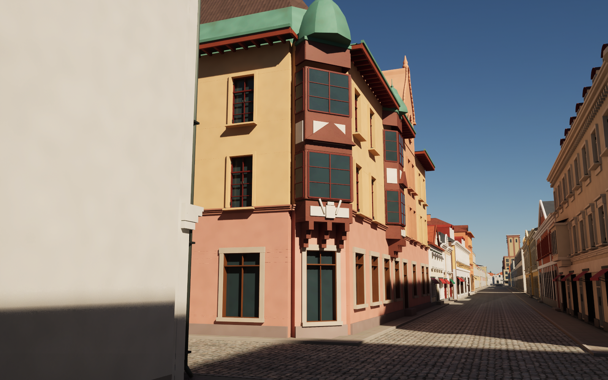
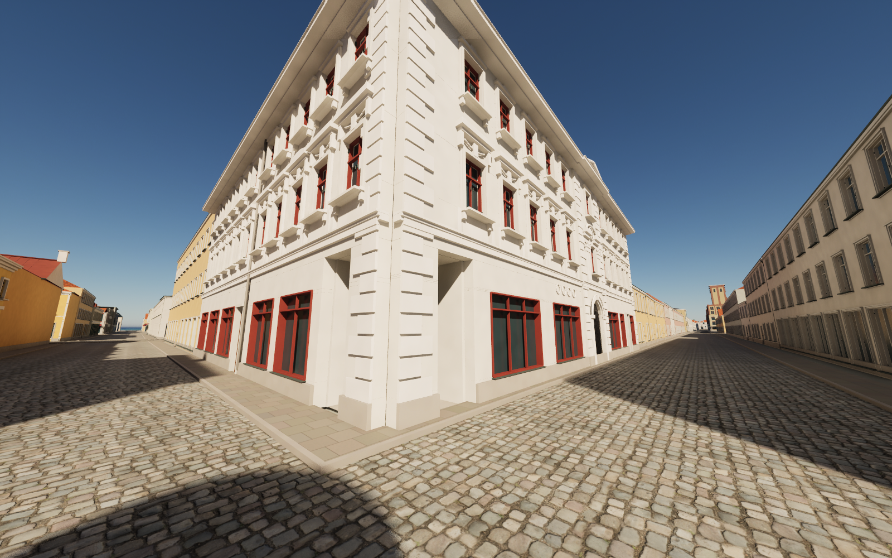
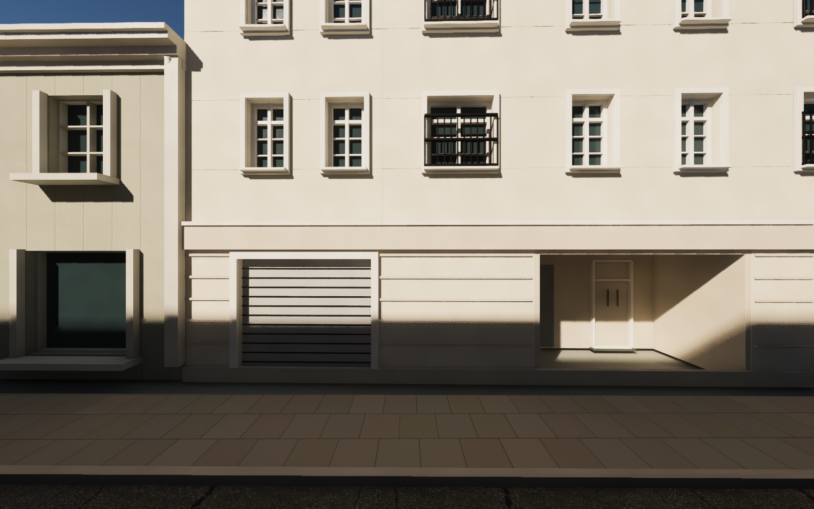
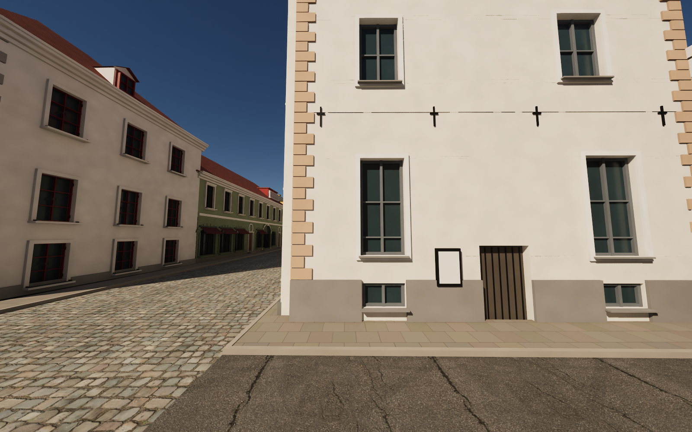
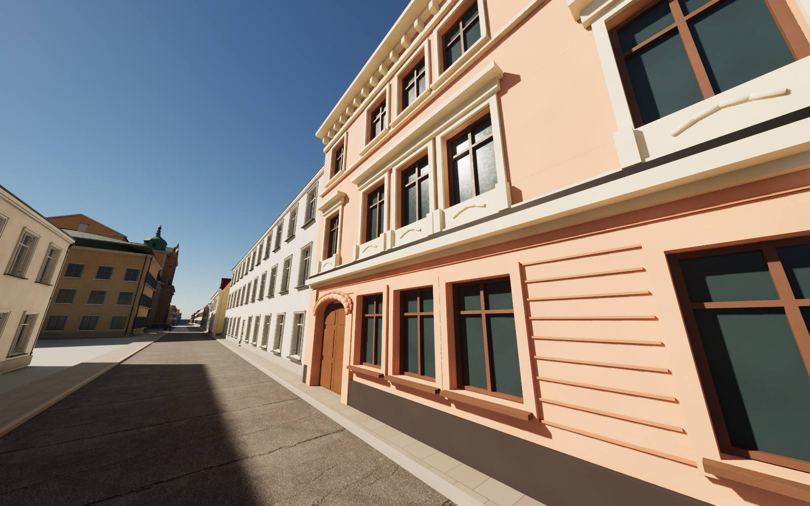
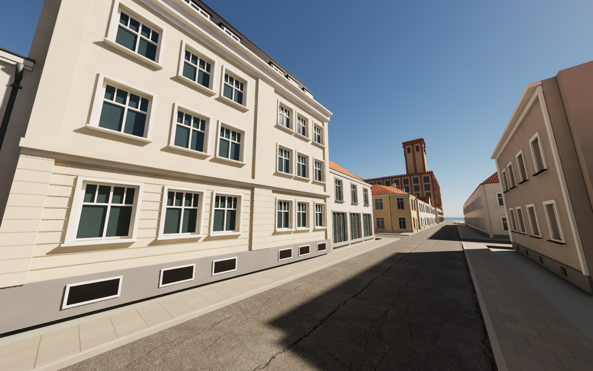

# The district houses — passes 28–74

Passes 28–74 replace generic district volumes with individually modelled houses along:
- Larmgatan and Kaggensgatan;
- Södra Långgatan, from Larmgatan to Östra Sjögatan;
- Ölandsgatan;
- Västra and Östra Sjögatan and Fiskaregatan;
- Norra Långgatan;
- Proviantgatan.

Each pass measured its houses from Google Street View panoramas and built them from Blender generator scripts:
- plinths and cellar windows;
- rustication, boarding and pilasters;
- windows and doors in their surrounds;
- bands, cornices, gables, dormers, mansards and roofs.

Street fronts are modelled from the panoramas. Yard sides and the parts of roofs that cannot be seen from the street keep a plain rhythm and are estimates. The 75 changed meshes total about 5.2 million triangles.

Pass 28 also corrects two earlier, published passes after re-measuring them with resected cameras:
- **Pass 24 (the Kalmar C station house):** the arch tops, the window rows and the gable's extent.
- **Pass 26 (Larmgatan 10, 8 and 6 and the Odd Fellows house):** the cornice heights, and the attic storey and oriel tower of Larmgatan 8.

## Passes

The calibration column compares the rendered model with each panorama over the features listed in the pass's notes.

| Pass | Houses | Calibration |
|---|---|---|
| 28 | The Larmgatan–Kaggensgatan block: Södra Långgatan 8, Södra Långgatan 10 (gate house and corner house), Kaggensgatan 5, the courtyard house and the three Ölandsgatan houses (OSM ways 91856615, 91856624, 91856594, 91856619, 91856622), and the re-measured pass 26 houses on Larmgatan; the re-measured pass 24 station house (OSM 90965009, 90965025) | 71 features |
| 29 | The north side of Södra Långgatan between Larmgatan and Kaggensgatan: Södra Långgatan 9 with the courtyard house, Södra Långgatan 11, Södra Långgatan 13–15 (the long ochre house), Kaggensgatan 9 (the corner house) and Kaggensgatan 11 A–D (OSM ways 92204156, 92204161, 92204198, 92204187, 92204189). The Larmgatan corner building (92204170, 92204162) is left for a later pass | 33 features, median 7 px, max 27.0 px |
| 30 | The corner building Larmgatan 14 / Södra Långgatan (OSM 92204170): mansard, canted corner with the corner oriel, oriels on both fronts, two curved gable bays, fire walls. Larmgatan 16 (92204162) is not modelled | 58 features, median 5 px, max 35 px |
| 31 | Larmgatan 16 (OSM 92204162): the yellow two-storey front range with its carriage passage, shop windows, five upper windows and three dormers, and two courtyard wings | 22 features, median 3 px, max 14 px |
| 32 | Larmgatan 22 and 24 (OSM 92204181, 92204160), the Larmgatan front of the block north of Storgatan, with their courtyard wings | 42 features, median 3 px, max 9 px |
| 33 | Södra Långgatan 16 (OSM 92379302), the palace-like corner house on the north-east corner of Södra Långgatan and Kaggensgatan | 44 features, median 3 px, max 12 px |
| 34 | The three low houses on Södra Långgatan east of number 16: the Blanc house (18, OSM 92379287), the yellow house (21, 92379267) and the cream house (92379282), with their rear ranges | 51 features, median 3 px, max 11 px |
| 35 | Two houses on the south side of Södra Långgatan, opposite pass 34: the wooden house (22, OSM 92379316) and the yellow palace with the stone portal (92379296), with their rear ranges | 80 features, median 2 px, max 11 px |
| 36 | OSM way 92379286 on the south side of Södra Långgatan: the cream house next to the palace and the stone corner house on Kaggensgatan with the 1659 portal, with their rear ranges | 72 features, median 3 px, max 9 px |
| 37 | OSM way 92379313 on the south side of Södra Långgatan: the grey office house, the yellow house number 28 and the corner house on Ölandsgatan, with the courtyard block behind | 34 features, median 3 px, max 13 px |
| 38 | Two district volumes on the north side of Södra Långgatan: number 27 (92379256) and the Barometern building (92379310) | 30 features, median 4 px, max 10 px |
| 39 | Three district volumes on the south side of Södra Långgatan east of Västra Sjögatan: the yellow wooden corner house (92412832), the salmon house of Kalmar Stadsmission (92412859) and the grey wooden house (92412869) | 58 features, median 4 px, max 15 px |
| 40 | The district volume 92412846 on the south side of Södra Långgatan at the corner of Östra Sjögatan: the white-rendered two-storey stone house (numbers 41-43) | 28 features, median 2 px, max 9 px |
| 41 | The district volume 92412838 on the north side of Södra Långgatan (numbers 39-43): the white two-storey range of 1888 and 1940 with the rusticated portal and two gables | 25 features, median 3 px, max 18 px |
| 42 | The Östra Sjögatan front of 92412873: the Nordstjernan brewery, three roughcast houses and the yellow corner house Östra Sjögatan 1; the courtyard block and the Wahlberg house kept at pass 17's estimate | 24 features, median 5 px, max 20 px |
| 43 | The Södra Långgatan front (numbers 49-59) of the district volume 91846978: the cream hotel range with its gabled middle and arcade, the ochre-panelled range, the blue gabled house, the grey roughcast house and the salmon corner range with its front gable | 24 features, median 10 px, max 20 px |
| 44 | The district volume 92412862 at Västra Sjögatan and Ölandsgatan: the 17th-century stone corner house with its portal and two gables, the white house 2 Västra Sjögatan, the yellow wooden house on Ölandsgatan and the gate | 23 features, median 10 px, max 20 px |
| 45 | The district volumes 92379262 and 92379314 on the south side of Ölandsgatan: the yellow stone house, the entrance link, the beige house of 1909 with two front gables and three dormers, and the Frösunda house | 23 features, median 8 px, max 20 px |
| 46 | The district volumes 92379258 and 92379298 on the south side of Ölandsgatan: the salmon house (number 20), the courtyard wall with its gate, the grey roughcast house and the cream house with the rusticated ground floor | 18 features, median 8 px, max 30 px |
| 47 | The district volumes 92379306 and 92379253 on the north side of Ölandsgatan: the cream house, the narrow white wooden house with the garage (number 13) and the white stone house | 12 features, median 8 px, max 30 px |
| 48 | The district volume 92379261 on the north side of Ölandsgatan: the pale yellow two-storey house with the gateway | 13 features, median 6 px, max 46 px |
| 49 | The district volume 92379272 on the south side of Ölandsgatan: the cream roughcast house with the arched gateway and the ochre wooden corner house at Kaggensgatan with its boarded mansard storey | 21 features, median 8 px, max 55 px |
| 50 | The district volume 92379264 on the south side of Ölandsgatan: house number 14, the white two-storey house with the arched gateway, two shop windows, two round-headed doors and two dormers | 16 features, median 8 px, max 38 px |
| 51 | The Ölandsgatan range of the district volume 92379292: Kronan with its gable to the street, the low range with the carriage arch, and the old stone house with the half gable | 17 features, median 8 px, max 18 px |
| 52 | The district volumes 91856606 and 91856592 on the south side of Ölandsgatan west of Kaggensgatan: the cream corner house with its steep street gable and the grey-white house with green windows | 14 features, median 8 px, max 15 px |
| 53 | The district volumes 91856590 (Ölandsgatan 8, three storeys with a sandstone ground floor, quoins and a roof lantern) and 91856614 (the pale yellow wooden house with pilasters) | 13 features, median 6 px, max 12 px |
| 54 | The district volume 91285838 at the east end of Ölandsgatan: the classical two-storey building with two pedimented risalits, a central attic and a one-storey annex with a rounded east end | 17 features, median 8 px, max 20 px |
| 55 | The district volume 92379255 on the corner of Storgatan and Västra Sjögatan: the limestone-clad three-storey commercial building with a flat roof, shopfronts and an open corner arcade | 12 features, median 8 px, max 30 px |
| 56 | The district volume 92379307 on Västra Sjögatan: the green-boarded two-storey wooden house with white pilasters, a pedimented porch and a tile roof | 12 features, median 10 px, max 35 px |
| 57 | The district volume 91970300 on the corner of Norra Långgatan and Östra Sjögatan: the grey-boarded two-storey wooden house with panelled ground-floor windows, a red double door and a gateway | 13 features, median 10 px, max 25 px |
| 58 | The district volume 91970261 on Fiskaregatan and Östra Sjögatan: the pale yellow boarded two-storey range and the corner wing with a mansard gable | 14 features, median 9 px, max 30 px |
| 59 | The district volume 91970317 on Fiskaregatan: the green-boarded two-storey wooden house with a black gateway and three dormers | 11 features, median 12 px, max 25 px |
| 60 | The Fiskaregatan range of the district volume 91856608: the grey roughcast house (number 36) with a gambrel gable and the beige two-storey house with the apothecary's corner bay | 16 features, median 10 px, max 65 px |
| 61 | The district volume 91885539 on the corner of Norra Långgatan and Östra Sjögatan: the pale yellow two-storey house (Norra Långgatan 41) with pilasters, a carved door and a red gambrel roof with its gable to Östra Sjögatan | 14 features, median 11 px, max 20 px |
| 62 | The district volume 91885537 on Östra Sjögatan: the cream rendered two-storey house with paired round-headed ground windows over a rusticated cellar storey, a corbel frieze and a raised attic band | 10 features, median 8 px, max 15 px |
| 63 | The district volumes 91970370 and 91970388 on the west side of Östra Sjögatan: number 17 (pale yellow boarding, pilasters, a gabled dormer) and number 19 (grey-green boarding, a central gateway, three red dormers) | 12 features, median 10 px, max 30 px |
| 64 | The district volume 91885528 on the corner of Östra Sjögatan and Fiskaregatan: the ochre roughcast two-storey house with green-framed windows, a pale green plinth with cellar grilles and red dormers | 10 features, median 8 px, max 20 px |
| 65 | The district volumes 91846981, 91846966 and 91846970 on the north side of Fiskaregatan: three matching two-storey roughcast houses of the 1940s with grey-green plinths and hipped tile roofs | 12 features, median 10 px, max 12 px |
| 66 | The district volume 91885531 on Norra Långgatan 49: a salmon rendered three-storey house with a rusticated ground floor, the round-arched gateway and a grouped triple window over carved aprons | 9 features, median 12 px, max 16 px |
| 67 | The district volume 91885524 on Norra Långgatan 51: a yellow boarded two-storey house with six white pilasters, a green double door up three steps, a grey plinth with cellar windows and a red tile roof with an arched dormer | 9 features, median 10 px, max 14 px |
| 68 | The district volume 91926340 on the south side of Norra Långgatan: a white roughcast single-storey cottage with a green door, a steep mansard roof of dark tile with three white dormers, and a chimney | 6 features, median 8 px, max 16 px |
| 69 | The district volume 91926315 on the corner of Norra Långgatan and Proviantgatan: a pale yellow two-storey corner house with a canted corner, a rusticated ground floor, the door (23) up three steps and a hipped sheet-metal roof | 11 features, median 8 px, max 16 px |
| 70 | The district volume 93238145 on the west side of Proviantgatan: a pale rendered two-storey infill house with a boarded gateway, a glass stair tower, dark-framed windows and white box dormers on a tile roof | 9 features, median 10 px, max 16 px |
| 71 | The district volume 91926323 on the west side of Proviantgatan: a yellow boarded two-storey house with its gable to the street, three windows on each storey and one in the gable | 6 features, median 8 px, max 10 px |
| 72 | The district volume 91926300 on the corner of Proviantgatan and Storgatan: a grey roughcast two-storey house with four axes of white-framed six-pane windows, a broad white corner pilaster and a low hipped roof | 7 features, median 8 px, max 10 px |
| 73 | The district volume 93192422 on the east side of Proviantgatan: a cream rendered three-storey house with a rusticated ground floor, seven window axes either side of a pilaster strip, a profiled cornice and a dark mansard with dormers | 8 features, median 8 px, max 16 px |
| 74 | The district volume 93192350 on the east side of Proviantgatan: the beige rendered three-storey house with a grooved grey ground floor, three axes of wide windows and box dormers, and the southern part of the narrow white house with the red door | 7 features, median 12 px, max 16 px |

## Measurement

Street View positions are not trusted as reported. Each camera is resected on known points:
- the joints and corners from OpenStreetMap;
- the facade base row;
- where needed, features shared with panoramas already fixed in earlier passes.

The April 2025 imagery comes from a roof camera about 2.0–2.6 m above the facade base. Features are read on the facade plane. Projecting cornices, dormers and set-back roofs are corrected for their depth, or triangulated from two panoramas.

Every pass's notes (`references/blockNN-notes.md`) list:
- the panoramas used;
- the anchors;
- the measured and modelled values;
- what is estimated.

No panorama pixels are embedded or redistributed. All new materials tint existing texture sets; there are no new texture sets.

## Known limitations

- **Pass 43** is calibrated over whole views only.
- **Passes 53–59:** the ground floors were read on the horizon row and can be up to 0.3 m off.
- **Pass 60** details only the Fiskaregatan range of its volume; the rest of 91856608 stays at district height.
- **Passes 67 and 71** end their outlines at the measured corners. The leftover strips, a fenced gap and a yard gate, are open ground.
- **Pass 71** completes the pass 70 house's south wall below the district height.
- **Pass 74** is measured only from two oblique panoramas (about ±0.3 m).
- **Tenant names, shop signs and logos** are omitted. No interiors are built.

## Rebuild

Download the pinned release assets. Each pass has `scripts/rebuild_blockNN.py`. It re-runs the builders of passes 26 and 28–NN, which rebuild those houses unchanged, and exports only pass NN's meshes. Run it with Blender in `--background` mode, then `scripts/sanitize_public_blend.py` on the public scene.

`scripts/prepare_blockNN.py` (Shapely) regenerates `source/blockNN.json` from the district outlines.

In Unreal:
1. Run `Unreal/Content/Python/resume_blockNN.py` with `-HeroIdle`.
2. Run `validate_blockNN.py`.

Remove `previews/blockNN-import.json` and `-materials.json` only when deliberately re-importing a revised mesh.

## Validation of this snapshot

- **Scene rebuild:** the public Blender scene was rebuilt from the scripts in one run of all builders. All 78 changed meshes, including the corrected station house, match the development builds' geometry, UV and material hashes and the per-pass repeatability records.
- **Exports:** the exported FBX normal, tangent and binormal vectors are all finite and non-zero.
- **Collision:** the per-pass tests take 5,412 ground samples and 5,113 character-width capsule sweeps in front of the new street fronts.
