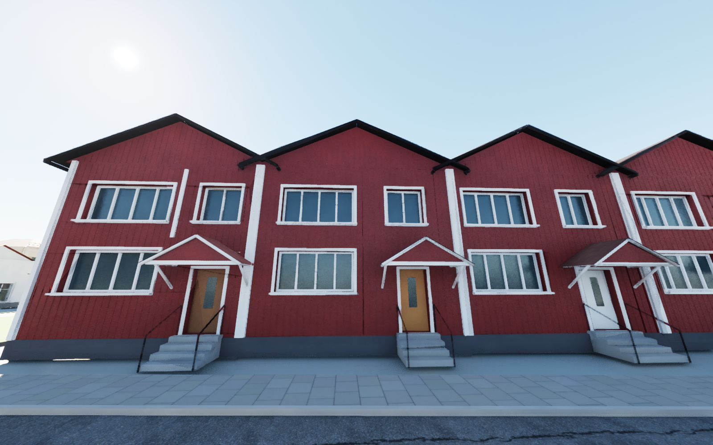
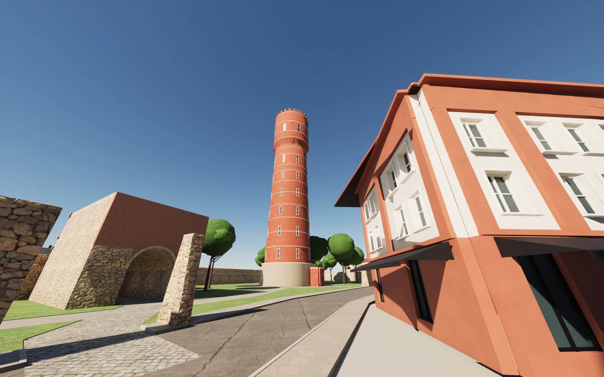
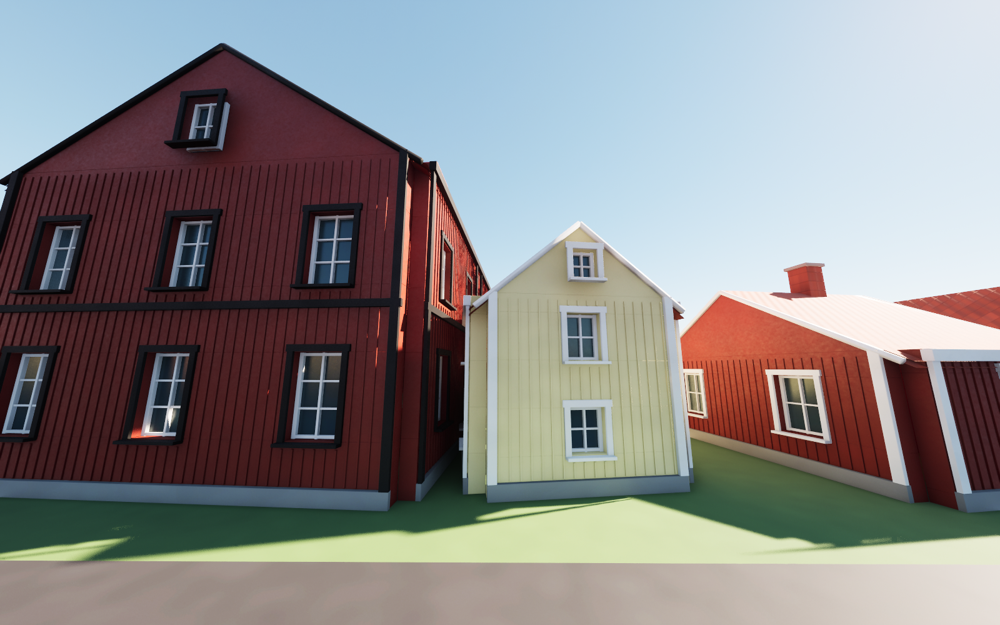
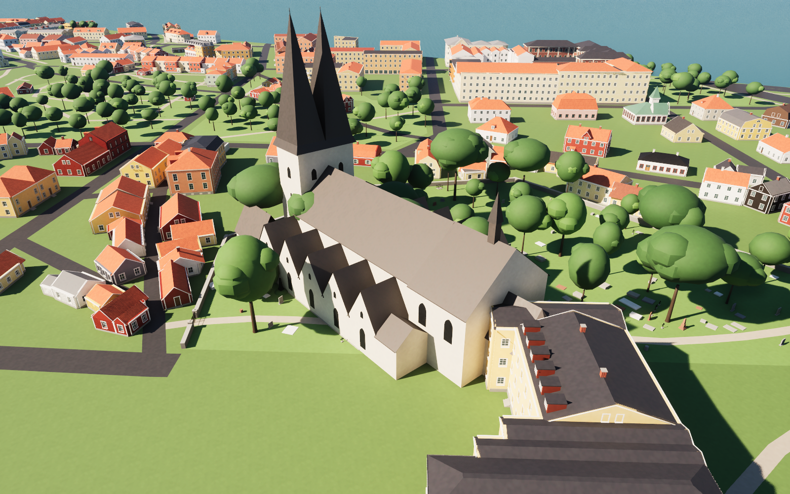
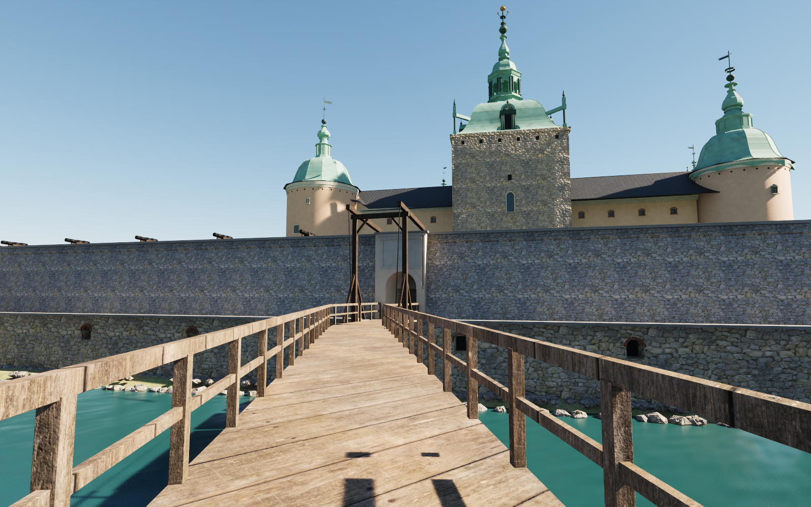
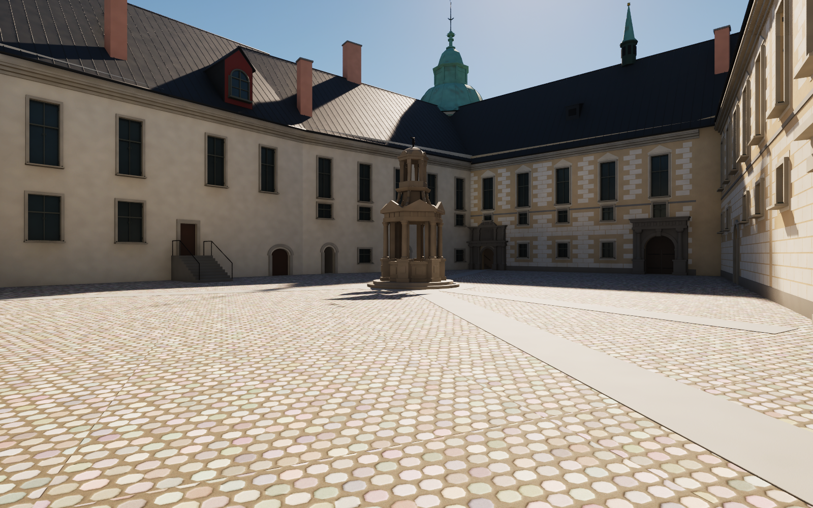
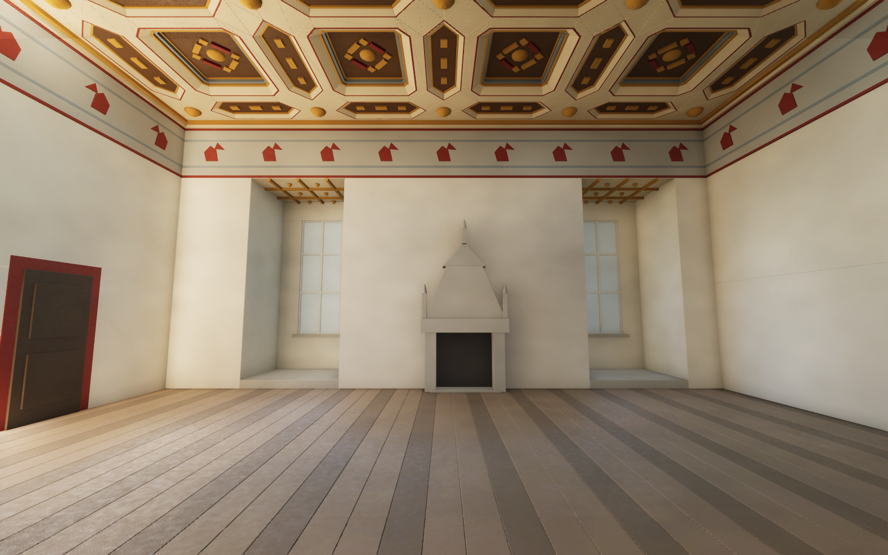
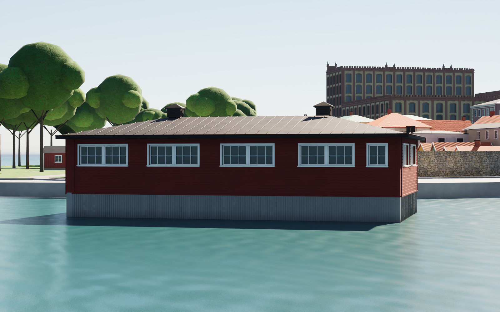

# Kvarnholmen's last houses, the mainland and Kalmar slott — passes 75–144

Passes 75–144 follow release v0.1.7 (passes 28–74). They cover:
- the remaining street houses on Kvarnholmen: Norra Långgatan, Kom snart igen and Skeppsbron, the warehouse row, Proviantgatan, Södra Långgatan, Ölandsgatan, Storgatan, Landshövdingegatan, Fiskaregatan, Östra Vallgatan, Kaggensgatan, Strömgatan and Larmgatan;
- the green areas and a review of the city wall (pass 79);
- the courtyard houses, back ranges and sheds inside the Kvarnholmen blocks (passes 121–122), and Klapphuset rebuilt from photographs (pass 144);
- Gamla vattentornet (passes 111–112) and the prison, Anstalten Kalmar (passes 85 and 103);
- the mainland west of Kvarnholmen: the ground, streets, parks and cemeteries (pass 98), Gamla kyrkogården with the Stagnell burial chapel and Bykyrkan as it stood about 1610 (pass 107), and every mainland house, street by street (passes 115–142);
- Kalmar slott in depth (passes 124–143): the approach and the gate passage, the courtyard level, fronts and roofs, the chimneys, dormers and portals, the tower caps, and the interiors of Gyllene salen, Kungsmaket, Kungstrappan, Slottskyrkan, Gröna salen, Förbrända salen, Kungsköket, Rutsalen and Drottningsalen.

Street fronts on Kvarnholmen and the mainland are measured from Google Street View panoramas, as in passes 28–74. Yard houses that no street view reaches are read from top-down satellite views. The castle is measured mainly on survey drawings in Riksarkivet and on public-domain photographs. Yard sides, roofs that cannot be seen from the street, and every value the notes mark as estimated remain estimates. The 666 changed meshes total about 20.5 million triangles.

## Method

Street View positions are not trusted as reported. Where two known points are in view, each camera is resected on OpenStreetMap corners and joints on the facade plane, 0.355 m outside the OSM line where the model's walls stand; the facade base row checks the camera height. Where only one corner or none is visible, the camera's distance comes from the base row or from a known size (a door, a storey), and the notes say so. Panoramas were viewed only. No panorama or photo pixel is embedded, used as a texture or redistributed, and the research photos are not in this repository.

The yard houses (passes 121, 122 and 142) are read from satellite views registered to the local frame (0.307 m/px and 0.161 m/px). They give the roof form, ridge direction and roof colour; heights come from storeys and type.

Kalmar slott uses these sources:
- Carl Möller's sections of January 1882 ("Calmar slott. Profiler", Riksarkivet PK006-00041), read at 57.97 px/m;
- Möller's drawings for new tower roofs of 1885 (PK006-00048 to 00052);
- the plan of the chapel of about 1780 (Krigsarkivet 0424:058:212a);
- Helgo Zettervall's west elevation of 1883;
- photographs from Wikimedia Commons and DigitaltMuseum (Kalmar läns museum) with public-domain or Creative Commons licences;
- Martin Olsson's plan in *Fornvännen* 1974 and his articles of 1957 and 1964, which are in copyright and were read for reference only, never copied.

Gamla kyrkogården is georeferenced on Harald Åkerlund's grave plan and Rosman's excavation plan of 1924. The 1610 church follows Olsson's reconstructed plan and elevations in *Sveriges kyrkor*, used for reference only.

Every pass's notes (`references/blockNN-notes.md`) list the panoramas, photographs and drawings used, the anchors, the measured and modelled values, and what is estimated. All new materials tint existing texture sets; there are no new texture sets.

## Corrections of published passes

Some passes deliberately re-create meshes from passes in v0.1.7 or earlier:

- **Pass 14 (landmarks).**
  - Pass 79 corrects `SM_Kvarnholmen_Ringmur_Sodra`. The southern wall's inner side, facing Södra Vallgatan, is a grass slope up to the rampart, not 4.25 m masonry. The inner runs are removed and replaced by a grass glacis, with 54 pollarded limes on the crest.
  - Pass 120 rebuilds the fire station's modern western part (`SM_Kvarnholmen_House_91846968`). The photographs show three buildings where pass 14 had a cream box: a five-storey limestone corner block, a white wing with a mansard storey, and a glazed one-storey pavilion. The footprint reaches about 8 m north of the OSM north face (194 m² added). The 1905 station is pass 14's code, copied unchanged.
- **The Storgatan–Larmtorget extension.** Passes 108, 109 and 110 re-create eight of its estimated `SM_Building_*` meshes on their measured or photographed fronts: 92379295 (pass 108), 91846958 and 91846925 (pass 109), and 91265011, 91970373, 91970296, 92379278 and 92379304 (pass 110).
- **Pass 17 (Klapphuset).** Pass 122 re-creates Klapphuset (93199604) with piles, lap boarding, a grey roof, the east deck, and the pier moved to the middle of the south side, as the satellite view shows it. Pass 144 then rebuilds it from photographs: falu red walls under a black roof in place of pass 122's pale grey roof, trim and deck, a narrower pier, and no east deck.
- **Pass 27 (Kalmar slott).**
  - Pass 124 re-creates the walls, castle, towers and bridge meshes. Portal A is narrower and lighter, with the 1568 tablet under the coping. The passage under the rampart gets its whitewashed vault. The gate passage through Kuretornet and the west range replaces pass 27's blind recess. The bridge and drawbridge are rebuilt, and the well house is hexagonal, not octagonal.
  - Pass 125 cuts one box out of the north tower's skin for the door into Kungsmaket.
  - Pass 126 lowers the courtyard by 2.70 m, to z 5.47, with everything standing on it. It moves the west range's windows to Zettervall's axes and turns the north tower's main window.
  - Pass 127 lowers the courtyard eaves to z 17.01 (Möller 1882) and rebuilds the range roofs as one asymmetric surface, with the ridges at Möller's height.
  - Pass 128 replaces the chimneys: fifteen measured stacks instead of pass 27's four and pass 127's six.
  - Pass 129 corrects the courtyard dormers and doors.
  - Pass 132 rebuilds the five tower caps after Möller 1885.
  - Passes 133, 135 and 137 move or open courtyard doors, add portal G's opening and a second window on the south-west outer front, and give the north-east courtyard front its painted rustication.
  - Pass 141 raises the north tower's wall top by 1.01 m, to z 24.28.

## Passes

The calibration column gives the feature statistics where the pass's reports have them (passes 75–80). For the other passes it gives the measurement basis: the views, and how many cameras were resected.

### Kvarnholmen

| Pass | Subject | Calibration and sources |
|---|---|---|
| 75 | The corner of Proviantgatan and Norra Långgatan (OSM 93192446): Proviantgatan 20 with its mansard, the corner house 22, the dark ochre range with six red wall dormers, and the last metre of the pass 74 house | 13 features, median 8 px, max 16 px |
| 76 | The north side of Norra Långgatan (90859889, 90859896, 90859844): the green cottage with its cross gable, two carriage gates, two red boarded houses, a passage door and the white roughcast house | 15 features, median 10 px, max 14 px |
| 77 | The south side of Norra Långgatan (93192402, 93192406): the red gable cottage and the yellow apartment block with its loggias | 9 features, median 10 px, max 16 px |
| 78 | The cream house of 1887 on Norra Långgatan (93192377) | 9 features, median 8 px, max 14 px |
| 79 | Green areas and the city wall: lawns on the village greens and the east bastions, three playgrounds, 128 park trees, 54 pollarded limes on the southern rampart, the hedge on the Skeppsbrogatan wall; the correction of pass 14's southern wall | 5 panoramas; 8 features, median 12 px, max 16 px |
| 80 | The north side of Norra Långgatan east of pass 76: the gate wall, the olive gable house (90859833), the long white house the district import had dropped (90859904, a new mesh), the red gable house (90859843) and the white cottage (90859883) | 12 features, median 10 px, max 16 px |
| 81 | The east end of Norra Långgatan, both sides: five volumes split into eleven small boarded houses and gates (93192447, 93192416, 93192390, 93192433; 90859897, 90859890, 90859875, 90859864, 90859880) | 2 resected panoramas |
| 82 | The north side of Kom snart igen and Skeppsbron 13 (91915626, 91915628, 91915620, 91915631): the orange house with round windows, the yellow houses and the café | 4 panoramas, 2 resected |
| 83 | The warehouse row between Kom snart igen and Skeppsbron (91915622, 91915624): four boarded warehouses with frontispieces, the rendered end house and three links | 1 resected panorama; the other fronts follow the measured pattern |
| 84 | Skeppsbron 30 (91915619) | 1 panorama at 35 m; heights estimated |
| 85 | Anstalten Kalmar (91053122) on a new shore patch west of Västerport, with its walls, fences and the Rotunda (1118433612) | 1 panorama, 1 winter photograph; heights from storeys (building rebuilt in pass 103) |
| 86 | The west side of the Proviantgatan row (91928565, 91928576, 91928540, 91928545, 91928582): Proviantgatan 6, 8, 10 and 12 and the pink cottage | 4 resected panoramas; within about 10 px |
| 87 | The north side of the east end of Södra Långgatan: numbers 63, 67 and 69 and the gambrel house 91928566 | 4 panoramas (2 resected); a few to 20 px |
| 88 | Ölandsgatan 7 (92379283), Södra Vallgatan 15 (92379259), 91856598, the functionalist house 91856586 and the Larmgatan pavilion (91856600) | 5 panoramas; 10–20 px |
| 89 | Storgatan 60, 62 and 64 and the two lots east of them (91928538, 91928591, 91928561, 91928583, 91928590) | 5 panoramas (3 resected cleanly); a few px, 10–15 px on the green house |
| 90 | The north side of east Storgatan (93192351, 93192354, 93192423, 93192353, 93192374): the red cottage, the boarded pair, the cream house, the ochre gable house and the brick house of about 1890 | 4 panoramas; 5–12 px; heights ±10 % |
| 91 | The east end of Storgatan: three gable houses (93192424, 93192442, 93192397), the stepped-gable shop (91928597) and Storgatan 65 (91928575) | 3 resected panoramas |
| 92 | The west side of Landshövdingegatan north of Storgatan (93192387, 93192432, 93192395, 93192444, 93192382) | 4 resected panoramas |
| 93 | The east side of Landshövdingegatan (93199599, 93238178, 93238200, 93238168, 93238182, 93238147) | 4 resected panoramas; heights ±10 % |
| 94 | The south side of Fiskaregatan east of Östra Sjögatan: the office, the modernist block and two gable houses (91885523, 91926303, 91926337, 91926333) | 3 panoramas; 5–10 px |
| 95 | The south side of Fiskaregatan, east part (91926308, 91926299, 91926297, 91926357) | 3 panoramas; 5–8 px |
| 96 | North Proviantgatan, east side, and the west end of Fiskaregatan (90859877, 90859878, 90859832, 90859848, 90859847), with the long white stucco house with two baroque gables | 4 resected panoramas; 5–10 px |
| 97 | Six houses on Norra Långgatan (37, 43, 47, 55) and Östra Sjögatan (22, and the street piece of 91885535) | 6 panoramas, 2 resected; heights ±8 % on 43 and 47 |
| 99 | The red townhouse row on north Landshövdingegatan (90859885, 90859837, 90859849, 90859898) | 2 resected panoramas; 1–7 px at the eaves |
| 100 | Norra Långgatan 78–84 (93238210, 93238172, 93238187, 93238156) and the grey cottage on Östra Vallgatan (93238202) | 5 resected panoramas; within a few px |
| 101 | Östra Vallgatan 7–9: the grey house and three gable cottages (93238179, 93238159, 93238211, 93238209) | 2 resected panoramas |
| 102 | The far east end of Storgatan and the corner of Östra Vallgatan (93238165, 93238196, 93238164, 93238222, 93199630, 93199675, 93199606) | 4 panoramas, 5 views |
| 103 | Anstalten Kalmar rebuilt as the cross-shaped cell prison (pass 85's building mesh) | satellite view and the winter photograph; heights estimated |
| 104 | Kaggensgatan at Fiskaregatan (92204193, 92379265), the north side of Fiskaregatan (92204176, OSM ring repaired) and the south side of Strömgatan (550598948) | 3 panoramas, 4 views; a few to 20 px |
| 105 | Strömgatan (92204196, 92204205, 92204158, 92204154, 92204191, 92379281) and the Södra Kanalgatan block (91285791, generic) | 3 panoramas, 4 views; about 10 px |
| 106 | The north side of Södra Långgatan to Sjöfartsmuseet (91928568, 91928594, 93199647, 93199649) and the south end of Landshövdingegatan (91928552, 91928587, 93199672, 93199626) | 7 panoramas |
| 108 | Kaggensgatan (92204167, 92379295, 92379291, 92204171, 92379305) | 2 Google panoramas, 2 contributor photos (scaled, not resected) |
| 109 | North-west Kvarnholmen: Larmgatan 38 and 40, the round office drum at Larmgatan 50, 1 Strömgatan, 4 Norra Långgatan, the grey house 91846925 and the generic block 91846945 | 6 panoramas, 5 resected |
| 110 | Storgatan, Norra Långgatan, Södra Långgatan 25 and Västra Sjögatan 4 (91265011, 91970373, 91970296, 92379278, 92379304, 92379276, 92412841, 92204180, 91264997, 91970385) | 4 panoramas (2 resected), 6 contributor photos (style only) |
| 111 | The last street-facing pass-17 volumes: 50 Storgatan, 91926324, 91926325, 1 Proviantgatan, 30 Ölandsgatan, the grill kiosk, the Ölandskajen shed and Gamla vattentornet (91072716) | 8 views; the tower from one unresectable panorama |
| 112 | Corrections of four meshes: the 9 Larmgatan block (91846945, pass 109), Gamla vattentornet at 54.0 m (pass 111), 92204191 (pass 105) and 93238202 (pass 100) | the tower on a resected panorama (merlons 53.4 m); the restaurant's camera fitted on the tower |
| 113 | Twelve scattered volumes: the Ölandskajen magasin (90977144), the Skeppsbron hall (91915629), the north-shore pavilion (91846927), the bus-station pavilion (1049819215) and eight sheds | 4 unresected views; the sheds estimated |
| 114 | The round drum at 50 Larmgatan rebuilt (886305409, correcting pass 109): 66 facets and ten measured panel rows | 2 panoramas resected on the silhouette tangents; within a few px |
| 120 | The fire station's modern western part (91846968, correcting pass 14) | 3 panoramas (1 resection reused, 1 solved, 1 estimated) |
| 121 | Sixteen courtyard and back houses in the west half of Kvarnholmen, and the station-area sheds and pavilions | satellite, 0.307 m/px; one panorama check; all estimated |
| 122 | Twenty-five courtyard and back houses in the east half of Kvarnholmen, and Klapphuset (93199604) with its pier | satellite, 0.307 m/px; all estimated |
| 144 | Klapphuset (93199604) rebuilt, correcting pass 122: falu red lap boarding with red corner boards, white casement pairs high under the eaves, the green double door in a shallow bay, a low black standing-seam hip roof, grey skirting into the water and a 1.9 m pier | 4 Commons photographs, 2 photospheres (1 resected); pier 1.9 m between the posts |

### The mainland

| Pass | Subject | Calibration and sources |
|---|---|---|
| 98 | The mainland between Kvarnholmen and the castle, about 72 ha: streets and paths, Stadsparken, the Krusenstjernska garden, Kalmarsundsparken, 1,076 trees, Gamla and Södra kyrkogården with 7,238 grave markers, and 412 houses as plain volumes in three chunk meshes | OpenStreetMap (ODbL); no panorama |
| 107 | Gamla kyrkogården (149032114): walls, paths, 160 graves, six enclosures, the Kristoffer pillar, the church kerb and 17 old trees; the Stagnell burial chapel (500979084); Bykyrkan about 1610 as a separate historical layer | Åkerlund's grave plan (RMS 2.74 m), Rosman's 1924 plan, Olsson's reconstruction (reference only) |
| 115 | Stadsparken and Slottsvägen: Kalmar konstmuseum, Byttan, Slottshotellet, Västerlånggatan 1, the Söderport pavilion and nine more (14 houses out of the chunks) | 5 resected panoramas, 1 contributor photo |
| 116 | Gamla stan, Molinsgatan and the east part of Västerlånggatan: 37 houses | 28 views; 6 houses measured |
| 117 | Gamla stan, the west part of Västerlånggatan, Gamla Kungsgatan and Paters gränd: 40 houses | 4 resected views; 5 houses measured |
| 118 | Gamla stan, Kungsgatan, Söderportsgatan, Klostergatan and Skansgatan: 40 houses | 20 views; about ten houses measured |
| 119 | Gamla stan, Stora and Lilla Dammgatan, Bremergatan, Smålandsgatan and Spikgatan: 22 houses, among them Bremergatan 9 and 13 | 12 views; 7 houses measured |
| 123 | Corrections of pass 115: Slottshotellet's courtyard side, Kalmar konstmuseum's massing, Byttan and the park pavilion | contributor photos; ratios only, no resected camera |
| 134 | Ståthållaregatan, Gustaf Vasagatan, Vegagatan and Folkungagatan: 43 houses | 32 views, 3 resected |
| 136 | Drottning Margaretas väg, Sankt Eriks gata, Johan III:s gata and Sankta Britas gata: 53 houses | 16 views, 5 resected |
| 138 | Stensövägen, Stensviksvägen, Långviksvägen and Sturevägen: 61 houses, with the back lots of the closed villa quarter | 31 views, 6 resected |
| 139 | Järnvägsgatan, Tullslätten and their side streets: 19 houses, among them Tullbroskolan and the gymnasium | 28 views, 2 resected |
| 140 | The last 21 street houses: Ringgatan, Torsgatan, Baldersvägen, Lillegårdsgatan, Margaretaplan and three houses just beyond 25 m from their street | 31 views, 5 resected |
| 142 | The 59 mainland yard buildings, among them the former barracks on Gamla torget; pass 98's chunk meshes are left as hidden stubs | satellite, 0.161 m/px; 4 views, 1 resected |

### Kalmar slott

| Pass | Subject | Calibration and sources |
|---|---|---|
| 124 | The approach: the park lifted to the footbridge, the city wall and the 30-step stair, the bridge and drawbridge, portal A, the passage under the rampart, Västra förborgen, portal B, the gate passage through Kuretornet, portals C–F, the hexagonal well house and the courtyard paving | OSM, Commons and museum photographs, Olsson 1957 (reference only); cameras placed by eye |
| 125 | The first interiors: Gyllene salen with its coffered ceiling, Kungsmaket and a stand-in for room 61a | Olsson 1974 (reference only), Mandelgren 1848, the 1780 plan of room 62, photographs |
| 126 | The courtyard lowered to z 5.47; the west range's windows on Zettervall's axes; Kungstrappan and förstuga 55 | the step counts, Zettervall 1883, the levels of passes 27 and 125 |
| 127 | The courtyard eaves at z 17.01 and the asymmetric roofs; the courtyard window rows; painted rustication on the north-west and south-west fronts | Möller 1882 sections; outer eaves agree with pass 27 within 0.24 m |
| 128 | Fifteen chimneys | 3 resected panoramas (1–2°), the 2017 photograph, 2021 drone photographs |
| 129 | Courtyard dormers and doors, portal D on its stair, portal C rebuilt | 2014 panoramas from resected cameras |
| 130 | The interior of Slottskyrkan (room 86) and its furnishings | the c. 1780 plan (107.1 px/m), Möller 1882 chapel section |
| 131 | Gröna salen (room 87) and Förbrända salen (rooms 74 and 76) | Möller 1882 sections, Olsson 1974 registered (reference only), photographs 1919–2017 |
| 132 | The five tower caps after Möller 1885 | Möller 1885 sheets; finials within 0.25–0.40 m of pass 27's measured heights |
| 133 | Kyrkportalen moved to 2.37 m from the south corner; the stair up to the chapel; the chapel's doors opened | panorama seen square on (within 0.3 m), the 2017 photograph |
| 135 | Portal G with the walled-up passage; Kungsköket (room 43) with its great hearth | the 1960 photograph (projective fit), Selling's 1969 photographs |
| 137 | Kungsköket's hearth rebuilt; Gröna salen's second end-wall window; the north-east courtyard front rusticated | a resected 2009 photograph (≤1.5 px), the 1969 and 2022 photographs |
| 141 | The north tower's wall top raised to z 24.28 | Möller 1885's dimension; 3 resected views (mean z 24.53) |
| 143 | Rutsalen (room 63) and Drottningsalen (room 65) | Möller 1882 Rutsalen section, Olsson 1974 (reference only), photographs 1922–1933 |

## Known limitations

**Kalmar slott**
- **The courtyard level** (z 5.47) is set from the step counts of the castle's accessibility page; no source gives it directly. Möller's sections would put it about 0.7 m lower. The gate passage's 9.1 % ramp follows from that level and is an interpretation.
- **Kungstrappan's dog-leg form** and the ground-floor link from Kyrkportalen to the chapel stair (Kyrktrappan) are interpreted. No ground-floor plan was available.
- **The courtyard's state-floor window row** is kept on one level and on a 3.8 m spacing. The panoramas put its sills 0.7–1.3 m higher on three fronts, and the real spacing is irregular.
- **Pass 27's outline** is 1.5–2.5 m off at the south-east bend and the north corner. Kuretornet's outline (17.1 × 16.0 m) is wider than Möller's 14 m square, so its cap is stretched about 20 %.
- **The tower caps** follow Möller's 1885 design. Only the south and east caps were compared with photographs from measured cameras.
- **The north tower's wall top** (z 24.28) is good to about ±0.3 m.
- **The south-west outer front's windows** stand about 1.2 m east of the photograph.
- **Portals and stairs** are simplified. Portal D stands 0.8 m from its measured place, because its door must stay on one edge of pass 27's outline.
- **Kungsköket's** extent, its height and its hearth are read from captions and photographs without known cameras.
- **Rutsalen** is built with the flat ceiling of 1882. A painted coffered ceiling mentioned in secondary texts may be what visitors see today.
- **Interiors** carry no carved, gilt, intarsia or painted ornament beyond simple solids and flat colours, and no light sources. Room 61a is a plain stand-in, and Kungsmaket's parquet is a chequer.
- **Access:** Rutsalen, Drottningsalen and Förbrända salen are not joined to any built route from the courtyard.
- **Walk checks** in the courtyard and the interiors are Blender ray casts. In Unreal, only the approach to the bridge (pass 124) is covered by the street check; see Validation.

**Gamla vattentornet and the city wall**
- **Gamla vattentornet** is built to 54.0 m at the merlons, from a resected panorama. Swedish Wikipedia gives 65 m without a source. The foot stands on a stone base about 5 m high (±2 m) in place of the rampart, and the shaft below 26.5 m is estimated.
- **The wall stone** keeps pass 14's warm rubble texture; the real walls are grey-pink granite fieldstone. The west, north and Regeringen walls were not re-measured.
- **The gate tunnels:** the collision test lists 16 capsule hits in pass 14's gate tunnels. They are explained by Jordbroporten's central pier and by the ground probe finding the rampart over Kavaljersporten's vault.

**Kvarnholmen**
- **Scale conflicts** between neighbouring panoramas leave heights uncertain by about ±10 % on parts of Storgatan, Landshövdingegatan and Fiskaregatan (passes 90, 91, 93 and 94).
- **Contributor photos:** houses that rest on them (passes 108 and 110) have unreliable camera positions, so their openings are placed to about ±1 m.
- **Pass 62's door** on Östra Sjögatan is 3.3–4 m from where pass 97's view puts it. Pass 62 was not changed.
- **Mapping gaps:** several real buildings have no OSM outline and are missing: a dark two-storey box on Skeppsbron, a shelter in Stadsparken and a white house on Drottning Margaretas väg. Some gaps between outlines are not there in reality, for example the gap between y 49.25 and 52.43 on Landshövdingegatan (pass 92).
- **Unphotographed outlines:** 91285791 on Södra Kanalgatan is not photographed and is generic.
- **The drum at Larmgatan 50** stands on the OSM circle. The cameras suggest it may be 10–15 % larger.
- **The fire station's white wing** is seen only on its north face.

**The mainland**
- **The ground** is flat: there is no terrain, terrace or hill (Bremergatan 9, the villa above Söderportsgatan). The water edges follow OSM's coastline.
- **Gamla kyrkogården:** the grave plan and OSM disagree by up to 4.5 m at the south-west wall. Grave types and the 17 old trees are placed plausibly, not surveyed. Where the church kerb stones really stand is not documented.
- **Bykyrkan 1610** is simplified massing, its north side is inferred, and it overlaps the 1906 hospital building as a historical layer.
- **Gustaf Vasagatan 18** (93358501) is left empty as a cleared building site, on the strength of one panorama of April 2025.
- **Clipped houses:** eight houses touch pass 98's model box and are built only inside it, with plain walls on the box edge.
- **Yard houses** (passes 121, 122 and 142) are read from one satellite epoch. Their heights and wall colours are estimates.
- **Slottshotellet's** street sides and Kalmar konstmuseum's park and lake sides are estimates. The museum's tower height (18.5 m) is good to 17–20 m.
- **Pass 98's chunk meshes** `SM_Slott98_Buildings_W`, `_M` and `_E` hold no building after pass 142. Each keeps a hidden 0.4 m marker quad under the ground so that the export and audit chain stays intact.

**Everywhere**
- Window and door positions on unmeasured walls are regular bays. Roofs not seen from the street, yard sides and rear walls are estimates.
- Tenant names, shop signs and logos are omitted.

## Rebuild

Download the pinned release assets. Each pass has `scripts/rebuild_blockNN.py`. It re-runs the builders of passes 26 and 28–NN, which rebuild those houses unchanged, and exports only pass NN's meshes. The latest one, `scripts/rebuild_block144.py`, re-runs the builders of passes 26 and 28–144 and exports only pass 144's mesh. Run it with Blender in `--background` mode, then `scripts/sanitize_public_blend.py` on the public scene.

`scripts/prepare_blockNN.py` regenerates `source/blockNN.json` from the outlines and the pass's readings.

In Unreal:
1. Passes 75–80 and 144: run `Unreal/Content/Python/resume_blockNN.py` with `-HeroIdle`, or `refresh_blockNN.py`.
2. Passes 81–143: run `run_union_import.py`. It runs `import_union_081_143.py` unattended in one session, then saves and quits. This one session replaces the per-pass `refresh_blockNN.py` scripts, which are kept but were not used for this import: several meshes (the castle, pass 98's chunks) were re-created by many passes, and `exports/` holds only their final FBX.
3. Run `validate_blockNN.py` for the collision checks.

## Validation of this snapshot

- **Scene rebuild:** the public Blender scene was rebuilt from the scripts in one run of all builders of passes 26 and 28–144. All 1,061 meshes match the development build's geometry, UV and material hashes and transforms. That includes the 666 meshes that passes 75–144 changed, and all 666 per-pass repeatability records match. The only intended difference is the neutral altar canvas.
- **Exports:** the FBX audits of passes 75–144 find every exported normal, tangent and binormal vector finite and non-zero. Three meshes keep pre-existing zero-area UV triangles: one in `SM_Kvarnholmen_House_91915624` (pass 83), one in `SM_Slott98_Ground` (pass 98) and four in `SM_Slott138_93487562` (pass 138). Their development builds report the same.
- **Unreal:**
  - Passes 75–80 and 144 were imported with their `refresh_blockNN.py` scripts, and passes 81–143 in one `import_union_081_143.py` session (650 meshes). All import, material and render audits pass, and the render audits are identical to the development project's.
  - The map has 1,814 actors and no missing mesh or material references.
- **Collision, passes 75–81:** `validate_blockNN.py` takes 2,421 ground samples and 2,292 character-width capsule sweeps, and all seven pass. Pass 79 lists 16 hits in pass 14's gate tunnels, which were already there. Reruns of passes 75 and 80 with rendering enabled give the same results as the unattended runs.
- **Collision, passes 82–144:** the generated `validate_blockNN.py` scripts (82–144) were never completed (see [KNOWN_ISSUES.md](KNOWN_ISSUES.md)). A generic street check was run in their place:
  - **Method:** every mapped street within 40 m of a pass's changed meshes was sampled every 3 m, using Kvarnholmen's street lines and the OpenStreetMap streets on the mainland. Each sample was traced for ground, and each segment swept with the same capsule and sidestep test. That gives 13,684 samples and 12,464 sweeps.
  - **Obstructions:** no pass's own meshes block a street. Three ground seams on Olof Palmes gata, where the prison's shore patch meets Kvarnholmen's land, each have a verified sidestep.
  - **Samples without ground:** all 542 lie on OpenStreetMap streets that run on past the modelled ground.
  - **No street in range:** the castle's interior and roof passes and Klapphuset have no street within 40 m.
